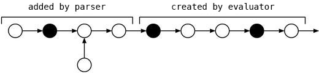
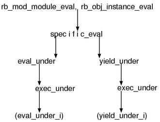

* * * * *

layout: default\
title: “Chapter 17: Dynamic evaluation”\
—\
h1. Chapter 17: Dynamic evaluation

Overview
--------

I have already finished to describe about the mechanism of the evaluator
by the\
previous chapter.\
In this chapter, by including the parser in addition to it,\
let’s examine the big picture as “the evaluator in a broad sense”.\
There are three targets: \`eval\`, \`Module\#module\_eval\` and\
\`Object\#instance\_eval\`.

### \`eval\`

I’ve already described about \`eval\`,\
but I’ll introduce more tiny things about it here.

By using \`eval\`, you can compile and evaluate a string at runtime in
the place.\
Its return value is the value of the last expression of the program.

<pre class="emlist">
p eval(“1 + 1”) \# 2\

</pre>
You can also refer to a variable in its scope from inside of a string to
\`eval\`.

<pre class="emlist">
lvar = 5\
`ivar = 6
p eval("lvar + `ivar“) \# 11\
\</pre\>

\
Readers who have been reading until here cannot simply read and pass
over the\
word”its scope“. For instance, you are curious about how is its”scope"
of\
constants, aren’t you? I am. To put the bottom line first, basically
you\
can think it directly inherits the environment of outside of \`eval\`.

And you can also define methods and define classes.

<pre class="emlist">
def a\
 eval(‘class C; def test() puts(“ok”) end end’)\
end

a() \# define class C and C\#test\
C.new.test \# shows ok\

</pre>
Moreover, as mentioned a little in the previous chapter,\
when you pass a \`Proc\` as the second argument, the string can be
evaluated in\
its environment.

<pre class="emlist">
def new\_env\
 n = 5\
 Proc.new { nil } \# turn the environment of this method into an object
and return it\
end

p eval(‘n \* 3’, new\_env()) \# 15\

</pre>
### \`module\_eval\` and \`instance\_eval\`

When a \`Proc\` is passed as the second argument of \`eval\`, the
evaluations can be\
done in its environment. \`module\_eval\` and \`instance\_eval\` is its
limited (or\
shortcut) version. With \`module\_eval\`, you can evaluate in an
environment that\
is as if in a module statement or a class statement.

<pre class="emlist">
lvar = “toplevel lvar” \# a local variable to confirm this scope

module M\
end\
M.module\_eval(\<\<‘EOS’) \# a suitable situation to use here-document\
 p lvar \# referable\
 p self \# shows M\
 def ok \# define M\#ok\
 puts ‘ok’\
 end\
EOS\

</pre>
With \`instance\_eval\`, you can evaluate in an environment whose
\`self\` of the\
singleton class statement is the object.

<pre class="emlist">
lvar = “toplevel lvar” \# a local variable to confirm this scope

obj = Object.new\
obj.instance\_eval(\<\<‘EOS’)\
 p lvar \# referable\
 p self \# shows \#<Object:0x40274f5c>\
 def ok \# define obj.ok\
 puts ‘ok’\
 end\
EOS\

</pre>
Additionally, these \`module\_eval\` and \`instance\_eval\` can also be
used as\
iterators, a block is evaluated in each environment in that case.\
For instance,

<pre class="emlist">
obj = Object.new\
p obj \# \#<Object:0x40274fac>\
obj.instance\_eval {\
 p self \# \#<Object:0x40274fac>\
}\

</pre>
Like this.

However, between the case when using a string and the case when using a
block,\
the behavior around local variables is different each other.\
For example, when creating a block in the \`a\` method then doing
\`instance\_eval\`\
it in the \`b\` method, the block would refer to the local variables of
\`a\`.\
When creating a string in the \`a\` method then doing \`instance\_eval\`
it in the\
\`b\` method, from inside of the string, it would refer to the local
variables of \`b\`.\
The scope of local variables is decided “at compile time”,\
the consequence differs because a string is compiled every time but a
block is\
compiled when loading files.

\`eval\`
--------

### \`eval()\`

The \`eval\` of Ruby branches many times based on the presence and
absence of the\
parameters. Let’s assume the form of call is limited to the below:

<pre class="emlist">
eval(prog\_string, some\_block)\

</pre>
Then, since this makes the actual interface function \`rb\_f\_eval()\`
almost\
meaningless, we’ll start with the function \`eval()\` which is one step
lower.\
The function prototype of \`eval()\` is:

<pre class="emlist">
static VALUE\
eval(VALUE self, VALUE src, VALUE scope, char **file, int line);\
\</pre\>

\
\`scope\` is the \`Proc\` of the second parameter.\
\`file\` and \`line\` is the file name and line number of where a string
to \`eval\`\
is supposed to be located. Then, let’s see the content:

\
\
▼ \`eval\` \</p\>
\
\<pre class=“longlist”\>\
4984 static VALUE\
4985 eval\
4986 VALUE self, src, scope;\
4987 char**file;\
4988 int line;\
4989 {\
4990 struct BLOCK **data = NULL;\
4991 volatile VALUE result = Qnil;\
4992 struct SCOPE** volatile old\_scope;\
4993 struct BLOCK \* volatile old\_block;\
4994 struct RVarmap \* volatile old\_dyna\_vars;\
4995 VALUE volatile old\_cref;\
4996 int volatile old\_vmode;\
4997 volatile VALUE old\_wrapper;\
4998 struct FRAME frame;\
4999 NODE **nodesave = ruby\_current\_node;\
5000 volatile int iter = ruby\_frame~~\>iter;\
5001 int state;\
5002\
5003 if ) { /\* always true now **/\
5009 Data\_Get\_Struct;\
5010 /** push BLOCK from data **/\
5011 frame = data~~\>frame;\
5012 frame.tmp = ruby\_frame; /\* to prevent from GC **/\
5013 ruby\_frame = &;\
5014 old\_scope = ruby\_scope;\
5015 ruby\_scope = data~~\>scope;\
5016 old\_block = ruby\_block;\
5017 ruby\_block = data~~\>prev;\
5018 old\_dyna\_vars = ruby\_dyna\_vars;\
5019 ruby\_dyna\_vars = data~~\>dyna\_vars;\
5020 old\_vmode = scope\_vmode;\
5021 scope\_vmode = data~~\>vmode;\
5022 old\_cref = ruby\_cref;\
5023 ruby\_cref = ruby\_frame~~\>cbase;\
5024 old\_wrapper = ruby\_wrapper;\
5025 ruby\_wrapper = data~~\>wrapper;\
5032 self = data~~\>self;\
5033 ruby\_frame~~\>iter = data~~\>iter;\
5034 }\
5045 PUSH\_CLASS;\
5046 ruby\_class = ruby\_cbase; /\*  ruby\_frame-\>cbase \*/
5047
5048      ruby\_in\_eval++;
5049      if (TYPE(ruby\_class)  T\_ICLASS) {\
5050 ruby\_class = RBASIC (ruby\_class)~~\>klass;\
5051 }\
5052 PUSH\_TAG;\
5053 if )  0) {
5054          NODE \*node;
5055
5056          result = ruby\_errinfo;
5057          ruby\_errinfo = Qnil;
5058          node = compile(src, file, line);
5059          if (ruby\_nerrs \> 0) {
5060              compile\_error(0);
5061          }
5062          if (!NIL\_P(result)) ruby\_errinfo = result;
5063          result = eval\_node(self, node);
5064      }
5065      POP\_TAG();
5066      POP\_CLASS();
5067      ruby\_in\_eval--;
5068      if (!NIL\_P(scope)) {  /\* always true now \*/
5069          int dont\_recycle = ruby\_scope-\>flags & SCOPE\_DONT\_RECYCLE;
5070
5071          ruby\_wrapper = old\_wrapper;
5072          ruby\_cref  = (NODE\*)old\_cref;
5073          ruby\_frame = frame.tmp;
5074          ruby\_scope = old\_scope;
5075          ruby\_block = old\_block;
5076          ruby\_dyna\_vars = old\_dyna\_vars;
5077          data-\>vmode = scope\_vmode; /\* save the modification of the visibility scope \*/
5078          scope\_vmode = old\_vmode;
5079          if (dont\_recycle) {
                  /\* ……copy SCOPE BLOCK VARS…… \*/
5097          }
5098      }
5104      if (state) {
5105          if (state  TAG\_RAISE) {\
 /** ……prepare an exception object…… **/\
5121 rb\_exc\_raise;\
5122 }\
5123 JUMP\_TAG;\
5124 }\
5125\
5126 return result;\
5127 }
\
\
\</pre\>

\
If this function is shown without any preamble, you probably feel
“oww!”.\
But we’ve defeated many functions of \`eval.c\` until here,\
so this is not enough to be an enemy of us.\
This function is just continuously saving/restoring the stacks.\
The points we need to care about are only the below three:

\
** unusually \`FRAME\` is also replaced \
\* \`ruby\_cref\` is substituted by \`ruby\_frame~~\>cbase\`\
** only \`scope\_vmode\` is not simply restored but influences \`data\`.

\
And the main parts are the \`compile\` and \`eval\_node\` located around
the\
middle. Though it’s possible that \`eval\_node\` has already been
forgotten,\
it is the function to start the evaluation of the parameter \`node\`.\
It was also used in \`ruby\_run\`.

\
Here is \`compile\`.

\
\
▼ \`compile\` \</p\>
\
\<pre class=“longlist”\>\
4968 static NODE\*\
4969 compile\
4970 VALUE src;\
4971 char **file;\
4972 int line;\
4973 {\
4974 NODE**node;\
4975\
4976 ruby\_nerrs = 0;\
4977 Check\_Type;\
4978 node = rb\_compile\_string;\
4979\
4980 if return node;\
4981 return 0;\
4982 }
\
\
\</pre\>

\
\`ruby\_nerrs\` is the variable incremented in \`yyerror\`.\
In other words, if this variable is non-zero, it indicates more than one
parse\
error happened. And, \`rb\_compile\_string\` was already discussed in
Part 2.\
It was a function to compile a Ruby string into a syntax tree.

\
One thing becomes a problem here is local variable.\
As we’ve seen in Chapter 12: Syntax tree construction,\
local variables are managed by using \`lvtbl\`.\
However, since a \`SCOPE\` already exists,\
we need to parse in the way of writing over and adding to it.\
This is in fact the heart of \`eval\`,\
and is the worst difficult part.\
Let’s go back to \`parse.y\` again and complete this investigation.

\
h3. \`top\_local\`

\
I’ve mentioned that the functions named \`local\_push local\_pop\` are
used\
when pushing \`struct local\_vars\`, which is the management table of
local\
variables,\
but actually there’s one more pair of functions to push the management
table.\
It is the pair of \`top\_local\_init\` and \`top\_local\_setup\`.\
They are called in this sort of way.

\
\
▼ How \`top\_local\_init\` is called \</p\>
\
\<pre class=“longlist”\>\
program : { top\_local\_init; }\
 compstmt\
 { top\_local\_setup; }\
\</pre\>

\
Of course, in actuality various other things are also done,\
but all of them are cut here because it’s not important.\
And this is the content of it:

\
\
▼ \`top\_local\_init\` \</p\>
\
\<pre class=“longlist”\>\
5273 static void\
5274 top\_local\_init\
5275 {\
5276 local\_push;\
5277 lvtbl~~\>cnt =
ruby\_scope~~\>local\_tbl?ruby\_scope~~\>local\_tbl[0]:0;\
5278 if {\
5279 lvtbl~~\>tbl = ALLOC\_N;\
5280 MEMCPY (lvtbl-\>tbl, ruby\_scope-\>local\_tbl, ID, lvtbl-\>cnt+1);\
5281 }\
5282 else {\
5283 lvtbl~~\>tbl = 0;\
5284 }\
5285 if \
5286 lvtbl~~\>dlev = 1;\
5287 else\
5288 lvtbl~~\>dlev = 0;\
5289 }
\
\
\</pre\>

\
This means that \`local\_tbl\` is copied from \`ruby\_scope\` to
\`lvtbl\`.\
As for block local variables, since it’s better to see them all at once
later,\
we’ll focus on ordinary local variables for the time being.\
Next, here is \`top\_local\_setup\`.

\
\
▼ \`top\_local\_setup\` \</p\>
\
\<pre class=“longlist”\>\
5291 static void\
5292 top\_local\_setup\
5293 {\
5294 int len = lvtbl-\>cnt; /** the number of local variables after
parsing **/\
5295 int i; /** the number of local varaibles before parsing **/\
5296\
5297 if {\
5298 i = ruby\_scope~~\>local\_tbl ? ruby\_scope~~\>local\_tbl[0] : 0;\
5299\
5300 if {\
5301 if  0) {
5302                  VALUE \*vars = ALLOC\_N(VALUE, len+1);
5303                  if (ruby\_scope-\>local\_vars) {
5304                      \*vars++ = ruby\_scope-\>local\_vars[-1];
5305                      MEMCPY(vars, ruby\_scope-\>local\_vars, VALUE, i);
5306                      rb\_mem\_clear(vars+i, len-i);
5307                  }
5308                  else {
5309                      \*vars++ = 0;
5310                      rb\_mem\_clear(vars, len);
5311                  }
5312                  ruby\_scope-\>local\_vars = vars;
5313                  ruby\_scope-\>flags |= SCOPE\_MALLOC;
5314              }
5315              else {
5316                  VALUE \*vars = ruby\_scope-\>local\_vars-1;
5317                  REALLOC\_N(vars, VALUE, len+1);
5318                  ruby\_scope-\>local\_vars = vars+1;
5319                  rb\_mem\_clear(ruby\_scope-\>local\_vars+i, len-i);
5320              }
5321              if (ruby\_scope-\>local\_tbl &&
                      ruby\_scope-\>local\_vars[-1]  0) {\
5322 free;\
5323 }\
5324 ruby\_scope-\>local\_vars = 0; /** NODE is not necessary anymore
**/\
5325 ruby\_scope~~\>local\_tbl = local\_tbl;\
5326 }\
5327 }\
5328 local\_pop;\
5329 }
\
\
\</pre\>

\
Since \`local\_vars\` can be either in the stack or in the heap, it
makes the code\
complex to some extent. However, this is just updating \`local\_tbl\`
and\
\`local\_vars\` of \`ruby\_scope\`. \`). And here, because there’s no
meaning of using \`alloca\`,\
it is forced to change its allocation method to \`malloc\`.

\
h3. Block Local Variable

\
By the way, how about block local variables?\
To think about this, we have to go back to the entry point of the parser
first,\
it is \`yycompile\`.

\
\
▼ setting \`ruby\_dyna\_vars\` aside\</p\>
\
\<pre class=“longlist”\>\
static NODE\*\
yycompile\
{\
 struct RVarmap **vars = ruby\_dyna\_vars;\
 :\
 n = yyparse;\
 :\
 ruby\_dyna\_vars = vars;\
}\
\</pre\>

\
This looks like a mere save-restore, but the point is that this does not
clear\
the \`ruby\_dyna\_vars\`. This means that also in the parser it directly
adds\
elements to the link of \`RVarmap\` created in the evaluator.

\
However, according to the previous description, the structure of\
\`ruby\_dyna\_vars\` differs between the parser and the evalutor.\
How does it deal with the difference in the way of attaching the header\
?

\
What is helpful here is the “1” of \`local\_push\` in
\`top\_local\_init\`.\
When the argument of \`local\_push\` becomes true,\
it does not attach the first header of \`ruby\_dyna\_vars\`.\
It means, it would look like Figure 1. Now, it is assured that\
we can refer to the block local variables of the outside scope\
from inside of a string to \`eval\`.

\
\
\
 \
Figure 1: \`ruby\_dyna\_vars\` inside \`eval\`\
** パーサで追加 added in the parser\
\* 評価機で作成 created in the evaluator\
\</div\>

\
Well, it’s sure we can refer to,\
but didn’t you say that \`ruby\_dyna\_vars\` is entirely freed in the
parser?\
What can we do if the link created at the evaluator will be freed?\
…\
I’d like the readers who noticed this to be relieved by reading the next
part.

\
\
▼ \`yycompile\` − freeing \`ruby\_dyna\_vars\`
\</p\>
\
\<pre class=“longlist”\>\
2386 vp = ruby\_dyna\_vars;\
2387 ruby\_dyna\_vars = vars;\
2388 lex\_strterm = 0;\
2389 while {\
2390 struct RVarmap **tmp = vp;\
2391 vp = vp-\>next;\
2392 rb\_gc\_force\_recycletmp);\
2393 }
\
\
\</pre\>

\
It is designed so that the loop would stop\
when it reaches the link created at the evaluator .

\
h2. \`instance\_eval\`

\
h3. The Whole Picture

\
The substance of \`Module\#module\_eval\` is \`rb\_mod\_module\_eval\`,\
and the substance of \`Object\#instance\_eval\` is
\`rb\_obj\_instance\_eval\`.

\
\
▼ \`rb\_mod\_module\_eval rb\_obj\_instance\_eval\`
\</p\>
\
\<pre class=“longlist”\>\
5316 VALUE\
5317 rb\_mod\_module\_eval\
5318 int argc;\
5319 VALUE**argv;\
5320 VALUE mod;\
5321 {\
5322 return specific\_eval;\
5323 }
\
5298 VALUE\
5299 rb\_obj\_instance\_eval\
5300 int argc;\
5301 VALUE **argv;\
5302 VALUE self;\
5303 {\
5304 VALUE klass;\
5305\
5306 if ) {\
5307 klass = Qnil;\
5308 }\
5309 else {\
5310 klass = rb\_singleton\_class;\
5311 }\
5312\
5313 return specific\_eval;\
5314 }
\
\
\</pre\>

\
These two methods have a common part as “a method to replace \`self\`
with \`class\`”,\
that part is defined as \`specific\_eval\`.\
Figure 2 shows it and also what will be described.\
What with parentheses are calls by function pointers.

\
\
\
 \
Figure 2: Call Graph\
\</p\>

\
Whichever \`instance\_eval\` or \`module\_eval\`,\
it can accept both a block and a string,\
thus it branches for each particular process to \`yield\` and \`eval\`
respectively.\
However, most of them are also common again,\
this part is extracted as \`exec\_under\`.

\
But for those who reading, one have to simultaneously face at 2 times 2
= 4 ways,\
it is not a good plan. Therefore, here we assume only the case when

\
\#1 it is an \`instance\_eval\`\
\#2 which takes a string as its argument

\
. And extracting all functions under \`rb\_obj\_instance\_eval\`
in-line,\
folding constants, we’ll read the result.

\
h3. After Absorbed

\
After all,\
it becomes very comprehensible in comparison to the one before being
absorbed.

\
\<p\
class=“caption”\>▼`specific_eval()`−`instance_eval`, `eval`,
string\</p\>
\
\<pre class=“longlist”\>\
static VALUE\
instance\_eval\_string\
 VALUE self, src;\
 const char**file;\
 int line;\
{\
 VALUE sclass;\
 VALUE result;\
 int state;\
 int mode;
\
 sclass = rb\_singleton\_class;
\
 PUSH\_CLASS;\
 ruby\_class = sclass;\
 PUSH\_FRAME;\
 ruby\_frame~~\>self = ruby\_frame~~\>prev~~\>self;\
 ruby\_frame~~\>last\_func = ruby\_frame~~\>prev~~\>last\_func;\
 ruby\_frame~~\>last\_class = ruby\_frame~~\>prev~~\>last\_class;\
 ruby\_frame~~\>argc = ruby\_frame~~\>prev~~\>argc;\
 ruby\_frame~~\>argv = ruby\_frame~~\>prev~~\>argv;\
 if {\
 ruby\_frame~~\>cbase = rb\_node\_newnode;\
 }\
 PUSH\_CREF;
\
 mode = scope\_vmode;\
 SCOPE\_SET;\
 PUSH\_TAG;\
 if ) == 0) {\
 result = eval;\
 }\
 POP\_TAG;\
 SCOPE\_SET;
\
 POP\_CREF;\
 POP\_FRAME;\
 POP\_CLASS;\
 if JUMP\_TAG;
\
 return result;\
}\
\</pre\>

\
It seems that this pushes the singleton class of the object to \`CLASS\`
and\
\`CREF\` and \`ruby\_frame~~\>cbase\`.\
The main process is one-shot of \`eval\`.\
It is unusual that things such as initializing \`FRAME\` by a
struct-copy are\
missing, but this is also not create so much difference.

\
h3. Before being absorbed

\
Though the author said it becomes more friendly to read,\
it’s possible it has been already simple since it was not absorbed,\
let’s check where is simplified in comparison to the before-absorbed
one.

\
The first one is \`specific\_eval\`. Since this function is to share the
code of\
the interface to Ruby, almost all parts of it is to parse the
parameters.\
Here is the result of cutting them all.

\
\
▼ \`specific\_eval\` \</p\>
\
\<pre class=“longlist”\>\
5258 static VALUE\
5259 specific\_eval\
5260 int argc;\
5261 VALUE**argv;\
5262 VALUE klass, self;\
5263 {\
5264 if (rb\_block\_given\_p()) {

5268 return yield\_under(klass, self);\
5269 }\
5270 else {

5294 return eval\_under(klass, self, argv[0], file, line);\
5295 }\
5296 }

(eval.c)\

</pre>
As you can see, this is perfectly branches in two ways based on whether
there’s\
a block or not, and each route would never influence the other.\
Therefore, when reading, we should read one by one.\
To begin with, the absorbed version is enhanced in this point.

And \`file\` and \`line\` are irrelevant when reading
\`yield\_under()\`,\
thus in the case when the route of \`yield\` is absorbed by the main
body,\
it might become obvious that we don’t have to think about the parse of
these\
parameters at all.

Next, we’ll look at \`eval\_under()\` and \`eval\_under\_i()\`.

▼ \`eval\_under()\`

<pre class="longlist">
5222 static VALUE\
5223 eval\_under(under, self, src, file, line)\
5224 VALUE under, self, src;\
5225 const char **file;\
5226 int line;\
5227 {\
5228 VALUE args[4];\
5229\
5230 if {\
5231 StringValue;\
5232 }\
5233 else {\
5234 SafeStringValue;\
5235 }\
5236 args[0] = self;\
5237 args[1] = src;\
5238 args[2] = file;\
5239 args[3] = line;\
5240 return exec\_under;\
5241 }
\
5214 static VALUE\
5215 eval\_under\_i\
5216 VALUE**args;\
5217 {\
5218 return eval(args[0], args[1], Qnil, (char**)args[2], args[3]);\
5219 }
\
\
\</pre\>

\
In this function, in order to make its arguments single,\
it stores them into the \`args\` array and passes it.\
We can imagine that this \`args\` exists as a temporary container to
pass from\
\`eval\_under\` to \`eval\_under\_i\`,\
but not sure that it is truly so.\
It’s possible that \`args\` is modified inside \`evec\_under\`.

\
As a way to share a code, this is a very right way to do.\
But for those who read it, this kind of indirect passing is
incomprehensible.\
Particularly, because there are extra castings for \`file\` and \`line\`
to fool\
the compiler, it is hard to imagine what were their actual types.\
The parts around this entirely disappeared in the absorbed version,\
so you don’t have to worry about getting lost.

\
However, it’s too much to say that absorbing and extracting always makes
things\
easier to understand.\
For example, when calling \`exec\_under\`, \`under\` is passed as both
the second\
and third arguments, but is it all right if the \`exec\_under\` side
extracts\
the both parameter variables into \`under\`?\
That is to say, the second and third arguments of \`exec\_under\` are,
in fact,\
indicating \`CLASS\` and \`CREF\` that should be pushed.\
\`CLASS\` and \`CREF\` are “different things”,\
it might be better to use different variables.\
Also in the previous absorbed version, for only this point,

\
\<pre class=“emlist”\>\
VALUE sclass = …..;\
VALUE cbase = sclass;\
\</pre\>

\
I thought that I would write this way,\
but also thought it could give the strange impression\
if abruptly only these variables are left,\
thus it was extracted as \`sclass\`.\
It means that this is only because of the flow of the texts.

\
By now, so many times, I’ve extracted arguments and functions,\
and for each time I repeatedly explained the reason to extract.\
They are

\
** there are only a few possible patterns\
\* the behavior can slightly change

Definitely, I’m not saying\
“In whatever ways extracting various things always makes things
simpler”.

In whatever case, what of the first priority is the comprehensibility
for\
ourself and not keep complying the methodology.\
When extracting makes things simpler, extract it.\
When we feel that not extracting or conversely bundling as a procedure
makes\
things easier to understand, let us do it.\
As for \`ruby\`, I often extracted them because the original is written
properly,\
but if a source code was written by a poor programmer,\
aggressively bundling to functions should often become a good choice.
