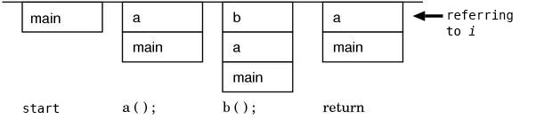
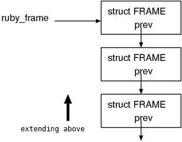
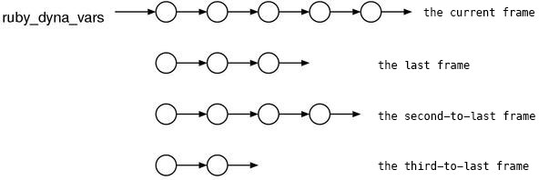
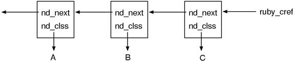
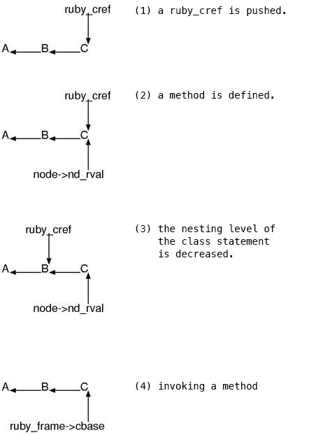
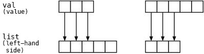

* * * * *

layout: default\
title: “Chapter 14: Context”\
—

Chapter 14: Context {#chapter}
===================

The range covered by this chapter is really broad. First of all, I’ll
describe\
about how the internal state of the evaluator is expressed. After that,
as\
an actual example, we’ll read how the state is changed on a class
definition\
statement. Subsequently, we’ll examine how the internal state influences
method\
definition statements. Lastly, we’ll observe how the both statements
change the\
behaviors of the variable definitions and the variable references.

The Ruby stack
--------------

### Context and Stack

With an image of a typical procedural language, each time calling a
procedure,\
the information which is necessary to execute the procedure such as the
local\
variable space and the place to return is stored in a struct (a stack
frame)\
and it is pushed on the stack.\
When returning from a procedure, the struct which is on the top of the
stack\
is popped and the state is returned to the previous method.\
The executing image of a C program which was explained at Chapter 5:
Garbage collection\
is a perfect example.

What to be careful about here is, what is changing during the execution
is only\
the stack, on the contrary, the program remains unchanged wherever it
is.\
For example, if it is “a reference to the local variable `i`”, there’s
just an\
order of “give me `i` of the current frame”, it is not written as “give
me `i`\
of that frame”. In other words, “only” the state of the stack influences
the\
consequence. This is why,\
even if a procedure is called anytime and any number of times,\
we only have to write its code once (Fig. 1).

 \
Fig.1: What is changing is only the stack\

The execution of Ruby is also basically nothing but chained calls of
methods\
which are procedures, so essentially it has the same image as above.\
In other words, with the same code, things being accessed such as local\
variable scope and the block local scope will be changing.\
And these kind of scopes are expressed by stacks.

However in Ruby, for instance, you can temporarily go back to the scope\
previously used by using iterators or `Proc` .\
This cannot be implemented with just simply pushing/popping a stack.\
Therefore the frames of the Ruby stack will be intricately rearranged
during\
execution. Although I call it “stack”, it could be better to consider
it\
as a list.

Other than the method call, the local variable scope can also be changed
on the\
class definitions. So, the method calls does not match the transitions
of the\
local variable scope. Since there are also blocks, it’s necessary to
handle them\
separately. For these various reasons, surprisingly, there are seven
stacks.

  Stack Pointer   Stack Frame Type         Description
  --------------- ------------------------ ---------------------------------------------------
  `ruby_frame`    `struct FRAME`           the records of method calls
  `ruby_scope`    `struct SCOPE`           the local variable scope
  `ruby_block`    `struct BLOCK`           the block scope
  `ruby_iter`     `struct iter`            whether or not the current `FRAME` is an iterator
  `ruby_class`    `VALUE`                  the class to define methods on
  `ruby_cref`     `NODE` ( `NODE_CREF` )   the class nesting information

C has only one stack and Ruby has seven stacks, by simple arithmetic,
the\
executing image of Ruby is at least seven times more complicated than
C.\
But it is actually not seven times at all,\
it’s at least twenty times more complicated.

First, I’ll briefly describe about these stacks and their stack frame
structs.\
The defined file is either `eval.c` or `evn.h` . Basically these stack
frames\
are touched only by `eval.c` … is what it should be if it were
possible,\
but `gc.c` needs to know the struct types when marking,\
so some of them are exposed in `env.h` .

Of course, marking could be done in the other file but `gc.c` , but it
requires\
separated functions which cause slowing down. The ordinary programs had
better\
not care about such things, but both the garbage collector and the core
of the\
evaluator is the ruby’s biggest bottleneck, so it’s quite worth to
optimize\
even for just one method call.

### `ruby_frame`

`ruby_frame` is a stack to record method calls. The stack frame struct
is\
`struct FRAME`. This terminology is a bit confusing but please be aware
that\
I’ll distinctively write it just a frame when it means a “stack frame”
as a\
general noun and `FRAME` when it means `struct FRAME`.

▼ `ruby_frame`

<pre class="longlist">
16 extern struct FRAME {\
 17 VALUE self; /\* self **/\
 18 int argc; /** the argument count **/\
 19 VALUE**argv; /\* the array of argument values **/\
 20 ID last\_func; /** the name of this FRAME (when called) **/\
 21 ID orig\_func; /** the name of this FRAME (when defined) **/\
 22 VALUE last\_class; /** the class of last\_func’s receiver **/\
 23 VALUE cbase; /** the base point for searching constants and class
variables **/\
 24 struct FRAME**prev;\
 25 struct FRAME **tmp; /** to protect from GC. this will be described
later **/\
 26 struct RNode**node; /\* the file name and the line number of the
currently executed line. **/\
 27 int iter; /** is this called with a block? **/\
 28 int flags; /** the below two **/\
 29 }**ruby\_frame;

33 \#define FRAME\_ALLOCA 0 /\* FRAME is allocated on the machine stack
**/\
 34 \#define FRAME\_MALLOC 1 /** FRAME is allocated by malloc **/
\
\
\</pre\>

\
First af all, since there’s the `prev` member, you can infer that the
stack is\
made of a linked list.

\
\
\
 \
Fig.2: `ruby_frame`\
\</p\>

\
The fact that `ruby_xxxx` points to the top stack frame is common to all
stacks\
and won’t be mentioned every time.

\
The first member of the struct is `self` .\
There is also `self` in the arguments of `rb_eval()` ,\
but why this struct remembers another `self` ?\
This is for the C-level functions. More precisely, it’s for
`rb_call_super()` that is\
corresponding to `super` . In order to execute `super` , it requires the
receiver\
of the current method, but the caller side of `rb_call_super()` could
not have\
such information. However, the chain of `rb_eval()` is interrupted
before the\
time when the execution of the user-defined C code starts. Therefore,
the\
conclusion is that there need a way to obtain the information of `self`
out of\
nothing. And, `FRAME` is the right place to store it.

\
Thinking a little further, It’s mysterious that there are `argc` and
`argv` .\
Because parameter variables are local variables after all, it is
unnecessary to\
preserve the given arguments after assigning them into the local
variable with\
the same names at the beginning of the method, isn’t it?\
Then, what is the use of them ? The answer is that this is actually for\
`super` again. In Ruby, when calling `super` without any arguments, the
values of\
the parameter variables of the method will be passed to the method of
the\
superclass.\
Thus, the parameter variables must be reserved.

\
Additionally, the difference between `last_func` and `orig_func` will be
come\
out in the cases like when the method is `alias` ed.\
For instance,

\
\<pre class=“emlist”\>\
class C\
 def orig end\
 alias ali orig\
end\
C.new.ali\
\</pre\>

\
in this case, `last_func=ali` and `orig_func=orig` .\
Not surprisingly, these members also have to do with `super` .

\
h3. `ruby_scope`

\
`ruby_scope` is the stack to represent the local variable scope. The
method and\
class definition statements, the module definition statements and the
singleton\
class definition statements, all of them are different scopes. The stack
frame\
struct is `struct SCOPE`.\
I’ll call this frame `SCOPE` .

\
\
▼ `ruby_scope` \</p\>
\
\<pre class=“longlist”\>\
 36 extern struct SCOPE {\
 37 struct RBasic super;\
 38 ID**local\_tbl; /\* an array of the local variable names **/\
 39 VALUE**local\_vars; /\* the space to store local variables **/\
 40 int flags; /** the below four **/\
 41 }**ruby\_scope;

43 \#define SCOPE\_ALLOCA 0 /\* local\_vars is allocated by alloca **/\
 44 \#define SCOPE\_MALLOC 1 /** local\_vars is allocated by malloc **/\
 45 \#define SCOPE\_NOSTACK 2 /** POP\_SCOPE is done **/\
 46 \#define SCOPE\_DONT\_RECYCLE 4 /** Proc is created with this SCOPE
**/
\
\
\</pre\>

\
Since the first element is `struct RBasic`, this is a Ruby object. This
is in\
order to handle `Proc` objects. For example, let’s try to think about
the case\
like this:

\
\<pre class=“emlist”\>\
def make\_counter\
 lvar = 0\
 return Proc.new { lvar += 1 }\
end
\
cnt = make\_counter\
p cnt.call \# 1\
p cnt.call \# 2\
p cnt.call \# 3\
cnt = nil \# cut the reference. The created Proc finally becomes
unnecessary here.\
\</pre\>

\
The `Proc` object created by this method will persist longer than the
method that\
creates it. And, because the `Proc` can refer to the local variable
`lvar` ,\
the local variables must be preserved until the `Proc` will disappear.\
Thus, if it were not handled by the garbage collector, no one can
determine the\
time to free.

\
There are two reasons why `struct SCOPE` is separated from
`struct FRAME`.\
Firstly, the things like class definition statements are not method\
calls but create distinct local variable scopes.\
Secondly, when a called method is defined in C the Ruby’s local\
variable space is unnecessary.

\
h3. `ruby_block`

\
`struct BLOCK` is the real body of a Ruby’s iterator block or a `Proc`
object,\
it is also kind of a snapshot of the evaluator at some point.\
This frame will also be briefly written as `BLOCK` as in the same manner
as\
`FRAME` and `SCOPE` .

\
\
▼ `ruby_block` \</p\>
\
\<pre class=“longlist”\>\
 580 static struct BLOCK**ruby\_block;

559 struct BLOCK {\
 560 NODE **var; /** the block parameters（mlhs） **/\
 561 NODE**body; /\* the code of the block body **/\
 562 VALUE self; /** the self when this BLOCK is created **/\
 563 struct FRAME frame; /** the copy of ruby\_frame when this BLOCK is
created **/\
 564 struct SCOPE**scope; /\* the ruby\_scope when this BLOCK is created
**/\
 565 struct BLOCKTAG**tag; /\* the identity of this BLOCK **/\
 566 VALUE klass; /** the ruby\_class when this BLOCK is created **/\
 567 int iter; /** the ruby\_iter when this BLOCK is created **/\
 568 int vmode; /** the scope\_vmode when this BLOCK is created **/\
 569 int flags; /** BLOCK\_D\_SCOPE, BLOCK\_DYNAMIC **/\
 570 struct RVarmap**dyna\_vars; /\* the block local variable space **/\
 571 VALUE orig\_thread; /** the thread that creates this BLOCK **/\
 572 VALUE wrapper; /** the ruby\_wrapper when this BLOCK is created
**/\
 573 struct BLOCK**prev;\
 574 };

553 struct BLOCKTAG {\
 554 struct RBasic super;\
 555 long dst; /\* destination, that is, the place to return **/\
 556 long flags; /** BLOCK\_DYNAMIC, BLOCK\_ORPHAN **/\
 557 };
\
 576 \#define BLOCK\_D\_SCOPE 1 /** having distinct block local scope
**/\
 577 \#define BLOCK\_DYNAMIC 2 /** BLOCK was taken from a Ruby program
**/\
 578 \#define BLOCK\_ORPHAN 4 /** the FRAME that creates this BLOCK has
finished **/

\
\
\</pre\>

\
Note that `frame` is not a pointer. This is because the entire content
of\
`struct FRAME` will be all copied and preserved. The entire
`struct FRAME` is\
 allocated on the machine stack, but `BLOCK` could\
persist longer than the `FRAME` that creates it, the preservation is a\
preparation for that case.

\
Additionally, `struct BLOCKTAG` is separated in order to detect the same
block\
when multiple `Proc` objects are created from the block. The `Proc`
objects\
which were created from the one same block have the same `BLOCKTAG` .

\
h3. `ruby_iter`

\
The stack `ruby_iter` indicates whether currently calling method is an
iterator\
. The frame is `struct iter`.\
But for consistency I’ll call it `ITER` .

\
\
▼ `ruby_iter` \</p\>
\
\<pre class=“longlist”\>\
 767 static struct iter**ruby\_iter;

763 struct iter {\
 764 int iter; /\* the below three **/\
 765 struct iter**prev;\
 766 };

769 \#define ITER\_NOT 0 /\* the currently evaluated method is not an
iterator **/\
 770 \#define ITER\_PRE 1 /** the method which is going to be evaluated
next is an iterator **/\
 771 \#define ITER\_CUR 2 /** the currently evaluated method is an
iterator **/\
\
\</pre\>

\
Although for each method we can determine whether it is an iterator or
not,\
there’s another struct that is distinct from `struct FRAME`. Why?

\
It’s obvious you need to inform it to the method when “it is an
iterator”,\
but you also need to inform the fact when “it is not an iterator”.\
However, pushing a whole `BLOCK` just for this is very heavy. It will
also\
cause that in the caller side the procedures such as variable
references\
would needlessly increase.\
Thus, it’s better to push the smaller and lighter `ITER` instead of
`BLOCK` .\
This will be discussed in detail in Chapter 16: Blocks.

\
h3. `ruby_dyna_vars`

\
The block local variable space. The frame struct is `struct RVarmap`
that has\
already seen in Part 2. Form now on, I’ll call it just `VARS` .

\
\
▼ `struct RVarmap`\</p\>
\
\<pre class=“longlist”\>\
 52 struct RVarmap {\
 53 struct RBasic super;\
 54 ID id; /** the name of the variable **/\
 55 VALUE val; /** the value of the variable **/\
 56 struct RVarmap**next;\
 57 };

(env.h)\

</pre>
Note that a frame is not a single `struct RVarmap` but a list of the
structs (Fig.3).\
And each frame is corresponding to a local variable scope.\
Since it corresponds to “local variable scope” and not “block local
variable scope”,\
for instance, even if blocks are nested, only a single list is used to
express.\
The break between blocks are similar to the one of the parser,\
it is expressed by a `RVarmap` (header) whose `id` is `0` .\
Details are deferred again. It will be explained in Chapter 16: Blocks.

 \
Fig.3: `ruby_dyna_vars`\

### `ruby_class`

`ruby_class` represents the current class to which a method is defined.
Since\
`self` will be that class when it’s a normal class definition
statement,\
`ruby_class == self`. But, when it is the top level or in the middle of\
particular methods like `eval` and `instance_eval` ,
`self != ruby_class` is\
possible.

The frame of `ruby_class` is a simple `VALUE` and there’s no particular
frame\
struct. Then, how could it be like a stack? Moreover, there were many
structs\
without the `prev` pointer, how could these form a stack? The answer is
deferred\
to the next section.

From now on, I’ll call this frame `CLASS` .

### `ruby_cref`

`ruby_cref` represents the information of the nesting of a class.\
I’ll call this frame `CREF` with the same way of naming as before.\
Its struct is …

▼ `ruby_cref`

<pre class="longlist">
847 static NODE **ruby\_cref = 0;
\
\
\</pre\>

\
… surprisingly `NODE` . This is used just as a “defined struct which can
be\
pointed by a `VALUE`”. The node type is `NODE_CREF` and the assignments
of its\
members are shown below:

\
|*. Union Member |*. Macro To Access |*. Usage |\
| u1.value | nd\_clss | the outer class |\
| u2 | - | - |\
| u3.node | nd\_next | preserve the previous `CREF` |

\
Even though the member name is `nd_next` , the value it actually has is
the\
“previous (prev)” `CREF` . Taking the following program as an example,
I’ll\
explain the actual appearance.

\
\<pre class=“emlist”\>\
class A\
 class B\
 class C\
 nil \# （A）\
 end\
 end\
end\
\</pre\>

\
Fig.4 shows how `ruby_cref` is when evaluating the code .
\
\
\
 \
Fig.4: `ruby_cref`\
\</p\>

\
However, illustrating this image everytime is tedious and its intention
becomes unclear.\
Therefore, the same state as Fig.4 will be expressed in the following
notation:

\
\<pre class=“emlist”\>\
A ← B ← C\
\</pre\>

\
h3. `PUSH` / `POP` Macros
\
For each stack frame struct, the macros to push and pop are available.\
For instance, `PUSH_FRAME` and `POP_FRAME` for `FRAME` .\
Because these will appear in a moment,\
I’ll then explain the usage and content.

\
h3. The other states

\
While they are not so important as the main stacks, the evaluator of
`ruby` has\
the several other states. This is a brief list of them. However, some of
them\
are not stacks. Actually, most of them are not.

\
|*. Variable Name |*. Type |*. Meaning |\
| `scope_vmode` | `int` | the default visibility when a method is
defined |\
| `ruby_in_eval` | `int` | whether or not parsing after the evaluation
is started |\
| `ruby_current_node` | `NODE*` | the file name and the line number of
what currently being evaluated |\
| `ruby_safe_level` | `int` | `$SAFE` |\
| `ruby_errinfo` | `VALUE` | the exception currently being handled |\
| `ruby_wrapper` | `VALUE` | the wrapper module to isolate the
environment |

\
h2. Module Definition

\
The `class` statement and the `module` statement and the singleton
class\
definition statement, they are all implemented in similar ways.
\
Because seeing similar things continuously three times is not
interesting, this time let’s\
examine the `module` statement which has the least elements .

\
First of all, what is the `module` statement? Conversely, what should
happen is\
the module `statement` ? Let’s try to list up several features:

\
** a new module object should be created\
\* the created module should be `self`\
\* it should have an independent local variable scope\
\* if you write a constant assignment, a constant should be defined on
the module\
\* if you write a class variable assignment,\
 a class variable should be defined on the module.\
\* if you write a `def` statement, a method should be defined on the
module

What is the way to archive these things? … is the point of this
section.\
Now, let’s start to look at the codes.

### Investigation

▼The Source Program

<pre class="longlist">
module M\
 a = 1\
end\

</pre>

▼Its Syntax Tree

<pre class="longlist">
NODE\_MODULE\
nd\_cname = 9621 (M)\
nd\_body:\
 NODE\_SCOPE\
 nd\_rval = (null)\
 nd\_tbl = 3 [ \_ \~ a ]\
 nd\_next:\
 NODE\_LASGN\
 nd\_cnt = 2\
 nd\_value:\
 NODE\_LIT\
 nd\_lit = 1:Fixnum\

</pre>
`nd_cname` seems the module name. `cname` is probably either Const NAME
or Class\
NAME. I dumped several things and found that there’s always `NODE_SCOPE`
in\
`nd_body` . Since its member `nd_tbl` holds a local variable table and
its name\
is similar to `struct SCOPE`, it appears certain that this `NODE_SCOPE`\
plays an important role to create a local variable scope.

### `NODE_MODULE`

Let’s examine the handler of `NODE_MODULE` of `rb_eval()` . The parts
that are\
not close to the main line, such as `ruby_raise()` and error handling
were cut\
drastically. So far, there have been a lot of cutting works for 200
pages,\
it has already became unnecessary to show the original code.

▼ `rb_eval()` − `NODE_MODULE` (simplified)

<pre class="longlist">
case NODE\_MODULE:\
 {\
 VALUE module;

if (rb\_const\_defined\_at(ruby\_class, node~~\>nd\_cname)) {\
 /\* just obtain the already created module **/\
 module = rb\_const\_get;\
 }\
 else {\
 /** create a new module and set it into the constant **/\
 module = rb\_define\_module\_id;\
 rb\_const\_set;\
 rb\_set\_class\_path);\
 }
\
 result = module\_setup;\
 }\
 break;\
\</pre\>

\
First, we’d like to make sure the module is nested and defined above
`ruby_class` .\
We can understand it from the fact that it calls `ruby_const_xxxx()` on
`ruby_class` .\
Just once `ruby_cbase` appears, but it is usually identical to
`ruby_class` ,\
so we can ignore it. Even if they are different, it rarely causes a
problem.

\
The first half, it is branching by `if` because it needs to check if
the\
module has already been defined. This is because, in Ruby,\
we can do “additional” definitions on the same one module any number of
times.

\
\<pre class=“emlist”\>\
module M\
 def a \# M\#a is deifned\
 end\
end\
module M \# add a definition \
 def b \# M\#b is defined\
 end\
end\
\</pre\>

\
In this program, the two methods, `a` and `b` , will be defined on the
module `M` .

\
In this case, on the second definition of `M` the module `M` was already
set to\
the constant, just obtaining and using it would be sufficient. If the
constant\
`M` does not exist yet, it means the first definition and the module is
created\
@ )

\
Lastly, `module_setup()` is the function executing the body of a module\
statement. Not only the module statements but the class statements and
the\
singleton class statements are executed by `module_setup()` .\
This is the reason why I said “all of these three type of statements
are\
similar things”.\
For now, I’d like you to note that `node->nd_body` is passed as\
an argument.

\
h3. `module_setup`

\
For the module and class and singleton class statements,
`module_setup()`\
executes their bodies. Finally, the Ruby stack manipulations will appear
in\
large amounts.

\
\
▼ `module_setup()` \</p\>
\
\<pre class=“longlist”\>\
3424 static VALUE\
3425 module\_setup\
3426 VALUE module;\
3427 NODE**n;\
3428 {\
3429 NODE \* volatile node = n;\
3430 int state;\
3431 struct FRAME frame;\
3432 VALUE result; /\* OK **/\
3433 TMP\_PROTECT;\
3434\
3435 frame =**ruby\_frame;\
3436 frame.tmp = ruby\_frame;\
3437 ruby\_frame = &frame;\
3438\
3439 PUSH\_CLASS;\
3440 ruby\_class = module;\
3441 PUSH\_SCOPE;\
3442 PUSH\_VARS;\
3443\
 /\* （A）ruby\_scope~~\>local\_vars initialization **/\
3444 if {\
3445 VALUE**vars = TMP\_ALLOC(node-\>nd\_tbl[0]+1);\
3446 **vars++ = node;\
3447 ruby\_scope~~\>local\_vars = vars;\
3448 rb\_mem\_clear;\
3449 ruby\_scope~~\>local\_tbl = node~~\>nd\_tbl;\
3450 }\
3451 else {\
3452 ruby\_scope~~\>local\_vars = 0;\
3453 ruby\_scope~~\>local\_tbl = 0;\
3454 }\
3455\
3456 PUSH\_CREF;\
3457 ruby\_frame~~\>cbase = ruby\_cref;\
3458 PUSH\_TAG;\
3459 if )  0) {
3460          if (trace\_func) {
3461              call\_trace\_func("class", ruby\_current\_node, ruby\_class,
3462                              ruby\_frame-\>last\_func,
3463                              ruby\_frame-\>last\_class);
3464          }
3465          result = rb\_eval(ruby\_class, node-\>nd\_next);
3466      }
3467      POP\_TAG();
3468      POP\_CREF();
3469      POP\_VARS();
3470      POP\_SCOPE();
3471      POP\_CLASS();
3472
3473      ruby\_frame = frame.tmp;
3474      if (trace\_func) {
3475          call\_trace\_func("end", ruby\_last\_node, 0,
3476                          ruby\_frame-\>last\_func, ruby\_frame-\>last\_class);
3477      }
3478      if (state) JUMP\_TAG(state);
3479
3480      return result;
3481  }

(eval.c)
\</pre\>

This is too big to read all in one gulp.
Let's cut the parts that seems unnecessary.

First, the parts around @trace\_func@ can be deleted unconditionally.

We can see the idioms related to tags. Let's simplify them by expressing with
the Ruby's ensure.

Immediately after the start of the function, the argument n is purposefully
assigned to the local variable @node@ , but @volatile@ is attached to @node@ and
it would never be assigned after that, thus this is to prevent from being
garbage collected. If we assume that the argument was @node@ from the beginning,
it would not change the meaning.

In the first half of the function, there's the part manipulating @ruby\_frame@
complicatedly. It is obviously paired up with the part @ruby\_frame = frame.tmp@
in the last half. We'll focus on this part later, but for the time being this
can be considered as @push pop@ of @ruby\_frame@ .

Plus, it seems that the code (A) can be, as commented, summarized as the
initialization of @ruby\_scope-\>local\_vars@ . This will be discussed later.

Consequently, it could be summarized as follows:

\
▼ @module\_setup@ (simplified)\</p\>

\<pre class="longlist"\>
static VALUE
module\_setup(module, node)
    VALUE module;
    NODE \*node;
{
    struct FRAME frame;
    VALUE result;

    push FRAME
    PUSH\_CLASS();
    ruby\_class = module;
    PUSH\_SCOPE();
    PUSH\_VARS();
    ruby\_scope-\>local\_vars initializaion
    PUSH\_CREF(module);
    ruby\_frame-\>cbase = (VALUE)ruby\_cref;
    begin
        result = rb\_eval(ruby\_class, node-\>nd\_next);
    ensure
        POP\_TAG();
        POP\_CREF();
        POP\_VARS();
        POP\_SCOPE();
        POP\_CLASS();
        pop FRAME
    end
    return result;
}
\</pre\>

It does @rb\_eval()@ with @node-\>nd\_next@ ,
so it's certain that this is the code of the module body.
The problems are about the others. There are 5 points to see.

\* Things occur on @PUSH\_SCOPE() PUSH\_VARS()@
\* How the local variable space is allocated
\* The effect of @PUSH\_CLASS@
\* The relationship between @ruby\_cref@ and @ruby\_frame-\>cbase@
\* What is done by manipulating @ruby\_frame@

Let's investigate them in order.

h3. Creating a local variable scope

@PUSH\_SCOPE@ pushes a local variable space and @PUSH\_VARS()@ pushes a block
local variable space, thus a new local variable scope is created by these two.
Let's examine the contents of these macros and what is done.

\
▼ @PUSH\_SCOPE() POP\_SCOPE()@ \</p\>

\<pre class="longlist"\>
 852  \#define PUSH\_SCOPE() do {               \\
 853      volatile int \_vmode = scope\_vmode;  \\
 854      struct SCOPE \* volatile \_old;       \\
 855      NEWOBJ(\_scope, struct SCOPE);       \\
 856      OBJSETUP(\_scope, 0, T\_SCOPE);       \\
 857      \_scope-\>local\_tbl = 0;              \\
 858      \_scope-\>local\_vars = 0;             \\
 859      \_scope-\>flags = 0;                  \\
 860      \_old = ruby\_scope;                  \\
 861      ruby\_scope = \_scope;                \\
 862      scope\_vmode = SCOPE\_PUBLIC

 869  \#define POP\_SCOPE()                                      \\
 870      if (ruby\_scope-\>flags & SCOPE\_DONT\_RECYCLE) {        \\
 871         if (\_old) scope\_dup(\_old);                        \\
 872      }                                                    \\
 873      if (!(ruby\_scope-\>flags & SCOPE\_MALLOC)) {           \\
 874          ruby\_scope-\>local\_vars = 0;                      \\
 875          ruby\_scope-\>local\_tbl  = 0;                      \\
 876          if (!(ruby\_scope-\>flags & SCOPE\_DONT\_RECYCLE) && \\
 877              ruby\_scope != top\_scope) {                   \\
 878              rb\_gc\_force\_recycle((VALUE)ruby\_scope);      \\
 879          }                                                \\
 880      }                                                    \\
 881      ruby\_scope-\>flags |= SCOPE\_NOSTACK;                  \\
 882      ruby\_scope = \_old;                                   \\
 883      scope\_vmode = \_vmode;                                \\
 884  } while (0)

(eval.c)
\</pre\>

As the same as tags, @SCOPE@ s also create a stack by being synchronized with the
machine stack. What differentiate slightly is that the spaces of the stack
frames are allocated in the heap, the machine stack is used in order to create
the stack structure (Fig.5.).

\

\\<br\>
Fig.5. The machine stack and the SCOPE Stack
\</p\>

Additionally, the flags like @SCOPE\_@ something repeatedly appearing in the
macros are not able to be explained until I finish to talk all about
in what form each stack frame is remembered and about blocks.
Thus, these will be discussed in Chapter 16: Blocks all at once.

h3. Allocating the local variable space

As I mentioned many times, the local variable scope is represented by @struct SCOPE@.
But @struct SCOPE@ is literally a "scope" and it does not have the real body
to store local variables. To put it more precisely, it has the pointer to a
space but there's still no array at the place where the one points to. The
following part of @module\_setup@ prepares the array.

\
▼The preparation of the local variable slots\</p\>

\<pre class="longlist"\>
3444  if (node-\>nd\_tbl) {
3445      VALUE \*vars = TMP\_ALLOC(node-\>nd\_tbl[0]+1);
3446      \*vars++ = (VALUE)node;
3447      ruby\_scope-\>local\_vars = vars;
3448      rb\_mem\_clear(ruby\_scope-\>local\_vars, node-\>nd\_tbl[0]);
3449      ruby\_scope-\>local\_tbl = node-\>nd\_tbl;
3450  }
3451  else {
3452      ruby\_scope-\>local\_vars = 0;
3453      ruby\_scope-\>local\_tbl  = 0;
3454  }

(eval.c)
\</pre\>

The @TMP\_ALLOC()@ at the beginning will be described in the next section. If I
put it shortly, it is "@alloca@ that is assured to allocate on the stack
(therefore, we do not need to worry about GC)".

@node-\>nd\_tbl@ holds in fact the local variable name table that has appeared
in Chapter 12: Syntax tree construction. It means that @nd\_tbl[0]@ contains the table size and the rest is
an array of @ID@ . This table is directly preserved to @local\_tbl@ of @SCOPE@
and @local\_vars@ is allocated to store the local variable values.
Because they are confusing, it's a good thing writing some comments such as
"This is the variable name", "this is the value".
The one with @tbl@ is for the names.

\

\\<br\>
Fig.6. @ruby\_scope-\>local\_vars@
\</p\>

Where is this @node@ used?
I examined the all @local\_vars@ members but could not find the access to index
@-1@ in @eval.c@ . Expanding the range of files to investigate, I found the
access in @gc.c@ .

\
▼ @rb\_gc\_mark\_children()@ — @T\_SCOPE@ \</p\>

\<pre class="longlist"\>
 815  case T\_SCOPE:
 816    if (obj-\>as.scope.local\_vars &&
            (obj-\>as.scope.flags & SCOPE\_MALLOC)) {
 817        int n = obj-\>as.scope.local\_tbl[0]+1;
 818        VALUE \*vars = &obj-\>as.scope.local\_vars[-1];
 819
 820        while (n--) {
 821            rb\_gc\_mark(\*vars);
 822            vars++;
 823        }
 824    }
 825    break;

(gc.c)
\</pre\>

Apparently, this is a mechanism to protect @node@ from GC.
But why is it necessary to to mark it here?
@node@ is purposefully store into the @volatile@ local variable, so
it would not be garbage-collected during the execution of @module\_setup()@ .

Honestly speaking, I was thinking it might merely be a mistake for a while but
it turned out it's actually very important. The issue is this at the next
line of the next line:

\
▼ @ruby\_scope-\>local\_tbl@ \</p\>

\<pre class="longlist"\>
3449  ruby\_scope-\>local\_tbl = node-\>nd\_tbl;

(eval.c)
\</pre\>

The local variable name table prepared by the parser is directly used. When is
this table freed? It's the time when the @node@ become not to be referred from
anywhere. Then, when should @node@ be freed? It's the time after the @SCOPE@
assigned on this line will disappear completely. Then, when is that?

@SCOPE@ sometimes persists longer than the statement that causes the creation
of it. As it will be discussed at Chapter 16: Blocks,
if a @Proc@ object is created, it refers @SCOPE@ .
Thus, If @module\_setup()@ has finished, the @SCOPE@ created there is not
necessarily be what is no longer used. That's why it's not sufficient that
@node@ is only referred from (the stack frame of) @module\_setup()@ .
It must be referred "directly" from @SCOPE@ .

On the other hand, the @volatile node@ of the local variable cannot be removed.
Without it, @node@ is floating on air until it will be assigned to @local\_vars@ .

However then, @local\_vars@ of @SCOPE@ is not safe, isn't it?
@TMP\_ALLOC()@ is, as I mentioned, the allocation on the stack, it becomes
invalid at the time @module\_setup()@ ends. This is in fact, at the moment when
@Proc@ is created, the allocation method is abruptly switched to @malloc()@ .
Details will be described in Chapter 16: Blocks.

Lastly, @rb\_mem\_clear()@ seems zero-filling but actually it is @Qnil@ -filling to
an array of @VALUE@ ( @array.c@ ). By this, all defined local variables are
initialized as @nil@ .

h3. @TMP\_ALLOC@

Next, let's read @TMP\_ALLOC@ that allocates the local variable space.
This macro is actually paired with @TMP\_PROTECT@ existing silently at the
beginning of @module\_setup()@ . Its typical usage is this:

\<pre class="emlist"\>
VALUE \*ptr;
TMP\_PROTECT;

ptr = TMP\_ALLOC(size);
\</pre\>

The reason why @TMP\_PROTECT@ is in the place for the local variable definitions
is that ... Let's see its definition.

\
▼ @TMP\_ALLOC()@ \</p\>

\<pre class="longlist"\>
1769  \#ifdef C\_ALLOCA
1770  \# define TMP\_PROTECT NODE \* volatile tmp\_\_protect\_tmp=0
1771  \# define TMP\_ALLOC(n) \\
1772      (tmp\_\_protect\_tmp = rb\_node\_newnode(NODE\_ALLOCA,                 \\
1773                               ALLOC\_N(VALUE,n), tmp\_\_protect\_tmp, n), \\
1774       (void\*)tmp\_\_protect\_tmp-\>nd\_head)
1775  \#else
1776  \# define TMP\_PROTECT typedef int foobazzz
1777  \# define TMP\_ALLOC(n) ALLOCA\_N(VALUE,n)
1778  \#endif

(eval.c)
\</pre\>

... it is because it defines a local variable.

As described in Chapter 5: Garbage collection, in the environment of @\#ifdef C\_ALLOCA@ (that is,
the native @alloca()@ does not exist) @malloca()@ is used to emulate @alloca()@ .
However, the arguments of a method are obviously @VALUE@ s and
the GC could not find a @VALUE@ if it is stored in the heap.
Therefore, it is enforced that GC can find it through @NODE@ .

\

\\<br\>
Fig.7. anchor the space to the stack through @NODE@
\</p\>

On the contrary, in the environment with the true @alloca()@ , we can naturally
use @alloca()@ and there's no need to use @TMP\_PROTECT@ . Thus, a harmless
statement is arbitrarily written.

By the way, why do they want to use @alloca()@ very much by all means.
It's merely because " @alloca()@ is faster than @malloc()@ ", they said.
One can think that it's not so worth to care about such tiny difference,
but because the core of the evaluator is the biggest bottleneck of @ruby@ ,
... the same as above.

h3. Changing the place to define methods on.

The value of the stack @ruby\_class@ is the place to define a method on at the
time. Conversely, if one push a value to @ruby\_class@ , it changes the class to
define a method on. This is exactly what is necessary for a class statement.
Therefore, It's also necessary to do @PUSH\_CLASS()@ in @module\_setup()@ .
Here is the code for it:

\<pre class="emlist"\>
PUSH\_CLASS();
ruby\_class = module;
     ：
     ：
POP\_CLASS();
\</pre\>

Why is there the assignment to @ruby\_class@ after doing @PUSH\_CLASS()@ .
We can understand it unexpectedly easily by looking at the definition.

\
▼ @PUSH\_CLASS() POP\_CLASS()@ \</p\>

\<pre class="longlist"\>
 841  \#define PUSH\_CLASS() do { \\
 842      VALUE \_class = ruby\_class

 844  \#define POP\_CLASS() ruby\_class = \_class; \\
 845  } while (0)

(eval.c)
\</pre\>

Because @ruby\_class@ is not modified even though @PUSH\_CLASS@ is done,
it is not actually pushed until setting by hand.
Thus, these two are closer to "save and restore" rather than "push and pop".

You might think that it can be a cleaner macro if passing a class as the
argument of @PUSH\_CLASS()@ ... It's absolutely true, but because there are some
places we cannot obtain the class before pushing, it is in this way.

h3. Nesting Classes

@ruby\_cref@ represents the class nesting information at runtime. Therefore, it's
naturally predicted that @ruby\_cref@ will be pushed on the module statements or
on the class statements.
In @module\_setup()@ , it is pushed as follows:

\<pre class="emlist"\>
PUSH\_CREF(module);
ruby\_frame-\>cbase = (VALUE)ruby\_cref;
   ：
   ：
POP\_CREF();
\</pre\>

Here, @module@ is the module being defined.
Let's also see the definitions of @PUSH\_CREF()@ and @POP\_CREF()@ .

\
▼ @PUSH\_CREF() POP\_CREF()@ \</p\>

\<pre class="longlist"\>
 849  \#define PUSH\_CREF(c) \\
          ruby\_cref = rb\_node\_newnode(NODE\_CREF,(c),0,ruby\_cref)
 850  \#define POP\_CREF() ruby\_cref = ruby\_cref-\>nd\_next

(eval.c)
\</pre\>

Unlike @PUSH\_SCOPE@ or something, there are not any complicated techniques and
it's very easy to deal with.
It's also not good if there's completely not any such thing.

The problem remains unsolved is what is the meaning of @ruby\_frame-\>cbase@ .
It is the information to refer a class variable or a constant from the current @FRAME@ .
Details will be discussed in the last section of this chapter.

h3. Replacing frames

Lastly, let's focus on the manipulation of @ruby\_frame@ . The first thing is its
definition:

\<pre class="emlist"\>
struct FRAME frame;
\</pre\>

It is not a pointer. This means that the entire @FRAME@ is allocated on the stack.
Both the management structure of the Ruby stack and the local variable
space are on the stack, but in the case of @FRAME@ the entire struct is stored
on the stack. The extreme consumption of the machine stack by @ruby@ is the
fruit of these "small techniques" piling up.

Then next, let's look at where doing several things with @frame@ .

\<pre class="emlist"\>
frame = \*ruby\_frame;      /\* copy the entire struct \*/
frame.tmp = ruby\_frame;   /\* protect the original FRAME from GC \*/
ruby\_frame = &frame;      /\* replace ruby\_frame \*/
       ：
       ：
ruby\_frame = frame.tmp;   /\* restore \*/
\</pre\>

That is, @ruby\_frame@ seems temporarily replaced (not pushing).
Why is it doing such thing?

I described that @FRAME@ is "pushed on method calls", but to be more precise,
it is the stack frame to represent "the main environment to execute a Ruby program".
You can infer it from, for instance, @ruby\_frame-\>cbase@ which appeared previously.
@last\_func@ which is "the last called method name" also suggests it.

Then, why is @FRAME@ not straightforwardly pushed?
It is because this is the place where it is not allowed to push @FRAME@ .
@FRAME@ is wanted to be pushed, but if @FRAME@ is pushed,
it will appear in the backtraces of the program when an exception occurs.
The backtraces are things displayed like followings:

\<pre class="screen"\>
% ruby t.rb
t.rb:11:in \`c': some error occured (ArgumentError)
        from t.rb:7:in \`b'
        from t.rb:3:in \`a'
        from t.rb:14
\</pre\>

But the module statements and the class statements are not method calls,
so it is not desirable to appear in this. That's why it is "replaced" instead
of "pushed".

h2. The method definition

As the next topic of the module definitions, let's look at the method definitions.

h3. Investigation

\
▼The Source Program\</p\>

\<pre class="longlist"\>
def m(a, b, c)
  nil
end
\</pre\>

\
▼Its Syntax Tree\</p\>

\<pre class="longlist"\>
NODE\_DEFN
nd\_mid  = 9617 (m)
nd\_noex = 2 (NOEX\_PRIVATE)
nd\_defn:
    NODE\_SCOPE
    nd\_rval = (null)
    nd\_tbl = 5 [ \_ \~ a b c ]
    nd\_next:
        NODE\_ARGS
        nd\_cnt  = 3
        nd\_rest = -1
        nd\_opt = (null)
        NODE\_NIL
\</pre\>

I dumped several things and found that there's always @NODE\_SCOPE@ in @nd\_defn@ .
@NODE\_SCOPE@ is, as we've seen at the module statements,
the node to store the information to push a local variable scope.

h3. @NODE\_DEFN@

Subsequently, we will examine the corresponding code of @rb\_eval()@ . This part
contains a lot of error handlings and tedious, they are all omitted again.
The way of omitting is as usual, deleting the every parts to directly or
indirectly call @rb\_raise() rb\_warn() rb\_warning()@.

\
▼ @rb\_eval()@ − @NODE\_DEFN@ (simplified)\</p\>

\<pre class="longlist"\>
NODE \*defn;
int noex;

if (SCOPE\_TEST(SCOPE\_PRIVATE) || node-\>nd\_mid  init) {\
 noex = NOEX\_PRIVATE; （A）\
}\
else if ) {\
 noex = NOEX\_PROTECTED; （B）\
}\
else if {\
 noex = node~~\>nd\_noex; （C）\
}\
else {\
 noex = NOEX\_PUBLIC; （D）\
}
\
defn = copy\_node\_scope;\
rb\_add\_method;\
result = Qnil;\
\</pre\>

\
In the first half, there are the words like `private` or `protected` ,
so it is\
probably related to visibility. `noex` , which is used as the names of
flags,\
seems `NOde EXposure`. Let’s examine the `if` statements in order.

\
 `SCOPE_TEST()` is a macro to check if there’s an argument flag in\
`scope_vmode` . Therefore, the first half of this conditional statement
means\
“is it a `private` scope?”.\
The last half means “it’s `private` if this is defining `initialize`”.\
The method `initialize` to initialize an object will unquestionably
become `private` .

\
 It is `protected` if the scope is `protected` .\
My feeling is that there’re few cases `protected` is required in Ruby.

\
(C) This is a bug. I found this just before the submission of this
book,\
so I couldn’t fix this beforehand.\
In the latest code this part is probably already removed.\
The original intention is to enforce the methods defined at top level to
be `private` .

\
 If it is not any of the above conditions, it is `public` .

\
Actually, there’s not a thing to worth to care about until here. The
important\
part is the next two lines.

\
\<pre class=“emlist”\>\
defn = copy\_node\_scope;\
rb\_add\_method;\
\</pre\>

\
`copy_node_scope()` is a function to copy `NODE_SCOPE` attached to the\
top of the method body. It is important that `ruby_cref` is passed …\
but details will be described soon.

\
After copying, the definition is finished by adding it by
`rb_add_method()` .\
The place to define on is of course `ruby_class` .

\
h3. `copy_node_scope()`

\
`copy_node_scope()` is called only from the two places: the method
definition\
 and the singleton method definition in `rb_eval()` .\
Therefore, looking at these two is sufficient to detect how it is used.
Plus,\
the usages at these two places are almost the same.

\
\
▼ `copy_node_scope()` \</p\>
\
\<pre class=“longlist”\>\
1752 static NODE\*\
1753 copy\_node\_scope\
1754 NODE **node;\
1755 VALUE rval;\
1756 {\
1757 NODE**copy = rb\_node\_newnode;\
1758\
1759 if {\
1760 copy~~\>nd\_tbl = ALLOC\_N;\
1761 MEMCPY (copy-\>nd\_tbl, node-\>nd\_tbl, ID, node-\>nd\_tbl[0]+1);\
1762 }\
1763 else {\
1764 copy~~\>nd\_tbl = 0;\
1765 }\
1766 return copy;\
1767 }
\
\
\</pre\>

\
I mentioned that the argument `rval` is the information of the class
nesting\
 of when the method is defined. Apparently, it is `rval` because it\
will be set to `nd_rval` .

\
In the main `if` statement copies `nd_tbl` of `NODE_SCOPE` .\
It is a local variable name table in other words. The +1 at `ALLOC_N` is
to\
additionally allocate the space for `nd_tbl[0]` . As we’ve seen in Part
2,\
`nd_tbl[0]` holds the local variables count, that was “the actual length
of\
`nd_tbl` - 1”.

\
To summarize, `copy_node_scope()` makes a copy of the `NODE_SCOPE` which
is the\
header of the method body. However, `nd_rval` is additionally set and it
is the\
`ruby_cref` of when the class is defined. This\
information will be used later when referring constants or class
variables.

\
h3. `rb_add_method()`

\
The next thing is `rb_add_method()` that is the function to register a
method entry.

\
\
▼ `rb_add_method()` \</p\>
\
\<pre class=“longlist”\>\
 237 void\
 238 rb\_add\_method\
 239 VALUE klass;\
 240 ID mid;\
 241 NODE **node;\
 242 int noex;\
 243 {\
 244 NODE**body;\
 245\
 246 if ) klass = rb\_cObject;\
 247 if )) {\
 248 rb\_raise;\
 249 }\
 250 if ) rb\_error\_frozen;\
 251 rb\_clear\_cache\_by\_id;\
 252 body = NEW\_METHOD;\
 253 st\_insert~~\>m\_tbl, mid, body);\
 254 }
\
\
\</pre\>

\
`NEW_METHOD()` is a macro to create `NODE` .\
`rb_clear_cache_by_id()` is a function to manipulate the method cache.\
This will be explained in the next chapter “Method”.

\
Let’s look at the syntax tree which is eventually stored in `m_tbl` of a
class.\
I prepared `nodedump-method` for this kind of purposes.\

\
\<pre class=“screen”\>\
% ruby~~e ‘\
class C\
 def m(a)\
 puts “ok”\
 end\
end\
require “nodedump-method”\
NodeDump.dump C, :m \# dump the method m of the class C\
’\
NODE\_METHOD\
nd\_noex = 0 \
nd\_cnt = 0\
nd\_body:\
 NODE\_SCOPE\
 nd\_rval = Object \<~~ C\
 nd\_tbl = 3 [ \_ \~ a ]\
 nd\_next:\
 NODE\_ARGS\
 nd\_cnt = 1\
 nd\_rest = ~~1\
 nd\_opt = \
 U牙S頏著

\
**\* unhandled**\*

\
\</pre\>

\
There are `NODE_METHOD` at the top\
and `NODE_SCOPE` previously copied by `copy_node_scope()` at the next.\
These probably represent the header of a method.\
I dumped several things and there’s not any `NODE_SCOPE` with the
methods defined in C,\
thus it seems to indicate that the method is defined at Ruby level.

\
Additionally, at `nd_tbl` of `NODE_SCOPE` the parameter variable name
appears.\
I mentioned that the parameter variables are equivalent to the local
variables,\
and this briefly implies it.

\
I’ll omit the explanation about `NODE_ARGS` here\
because it will be described at the next chapter “Method”.

\
Lastly, the `nd_cnt` of the `NODE_METHOD` , it’s not so necessary to
care about\
this time. It is used when having to do with `alias` .

\
h2. Assignment and Reference

\
Come to think of it, most of the stacks are used to realize a variety
of\
variables. We have learned to push various stacks, this time let’s
examine the\
code to reference variables.

\
h3. Local variable

\
The all necessary information to assign or refer local variables has
appeared,\
so you are probably able to predict.\
There are the following two points:

\
\* local variable scope is an array which is pointed by
`ruby_scope->local_vars`\
\* the correspondence between each local variable name and each array
index has\
 already resolved at the parser level.

\
Therefore, the code for the local variable reference node `NODE_LVAR` is
as\
follows:

\
\
▼ `rb_eval()` − `NODE_LVAR` \</p\>
\
\<pre class=“longlist”\>\
2975 case NODE\_LVAR:\
2976 if {\
2977 rb\_bug;\
2978 }\
2979 result = ruby\_scope~~\>local\_vars[node~~\>nd\_cnt];\
2980 break;
\
\
\</pre\>

\
It goes without saying but `node->nd_cnt` is the value that
`local_cnt()` of the\
parser returns.

\
h3. Constant

\
h4. Complete Specification

\
In Chapter 6: Variables and constants,\
I talked about in what form constants are stored and API.\
Constants are belong to classes and inherited as the same as methods.\
As for their actual appearances, they are registered to `iv_tbl` of\
`struct RClass` with instance variables and class variables.

\
The searching path of a constant is firstly the outer class, secondly
the\
superclass, however, `rb_const_get()` only searches the superclass.
Why?\
To answer this question, I need to reveal the last specification of
constants.\
Take a look at the following code:

\
\<pre class=“emlist”\>\
class A\
 C = 5\
 def A.new\
 puts C\
 super\
 end\
end\
\</pre\>

\
`A.new` is a singleton method of `A` , so its class is the singleton
class `(A)` .\
If it is interpreted by following the rule,\
it cannot obtain the constant `C` which is belongs to `A` .

\
But because it is written so close, to become to want refer the constant
`C`\
is human nature. Therefore, such reference is possible in Ruby.\
It can be said that this specification reflects the characteristic of
Ruby\
“The emphasis is on the appearance of the source code”.

\
If I generalize this rule, when referring a constant from inside of a
method,\
by setting the place which the method definition is “written” as the
start\
point, it refers the constant of the outer class.\
And, “the class of where the method is written” depends on its context,\
thus it could not be handled without the information from both the
parser and\
the evaluator. This is why `rb_cost_get()` did not have the searching
path of\
the outer class.

\
h4. `cbase`

\
Then, let’s look at the code to refer constants including the outer
class.\
The ordinary constant references to which `::` is not attached, become\
`NODE_CONST` in the syntax tree. The corresponding code in `rb_eval()`
is …

\
\
▼ `rb_eval()` − `NODE_CONST` \</p\>
\
\<pre class=“longlist”\>\
2994 case NODE\_CONST:\
2995 result = ev\_const\_get, node~~\>nd\_vid, self);\
2996 break;
\
\
\</pre\>

\
First, `nd_vid` appears to be `Variable ID` and it probably means a
constant name.\
And, `ruby_frame->cbase` is “the class where the method definition is
written”.\
The value will be set when invoking the method, thus the code to set has
not appeared yet.\
And the place where the value to be set comes from is the `nd_rval`\
that has appeared in `copy_node_scope()` of the method definition.\
I’d like you to go back a little and check that the member holds the\
`ruby_cref` of when the method is defined.

\
This means, first, the `ruby_cref` link is built when defining a class
or a module.\
Assume that the just defined class is `C` ,

\
Defining the method `m` here,\
then the current `ruby_cref` is memorized by the method entry .
\
After that, when the class statement finished the `ruby_cref` would
start to\
point another node, but `node->nd_rval` naturally continues to point to
the\
same thing.

\
Then, when invoking the method `C#m` , get `node->nd_rval`\
and insert into the just pushed `ruby_frame->cbase` .

\
… This is the mechanism. Complicated.

\
\
\
 \
Fig 8. CREF Trasfer\
\</p\>

\
h4. `ev_const_get()`
\
Now, let’s go back to the code of `NODE_CONST` .\
Since only `ev_const_get()` is left, we’ll look at it.

\
\
▼ `ev_const_get()` \</p\>
\
\<pre class=“longlist”\>\
1550 static VALUE\
1551 ev\_const\_get\
1552 NODE**cref;\
1553 ID id;\
1554 VALUE self;\
1555 {\
1556 NODE **cbase = cref;\
1557 VALUE result;\
1558\
1559 while {\
1560 VALUE klass = cbase~~\>nd\_clss;\
1561\
1562 if ) return rb\_const\_get, id);\
1563 if ~~\>iv\_tbl &&\
 st\_lookup~~\>iv\_tbl, id, &result)) {\
1564 return result;\
1565 }\
1566 cbase = cbase~~\>nd\_next;\
1567 }\
1568 return rb\_const\_get;\
1569 }
\
\
\</pre\>

\
@ was wrong.\
 I omit this part for now. ))

\
h3. Class variable

\
What class variables refer to is also `ruby_cref` . Needless to say,\
unlike the constants which search over the outer classes one after
another,\
it uses only the first element.\
Let’s look at the code of `NODE_CVAR` which is the node to refer to a
class\
variable.

\
What is the `cvar_cbase()` ? As `cbase` is attached,\
it is probably related to `ruby_frame->cbase` , but how do they differ?\
Let’s look at it.

\
\
▼ `cvar_cbase()` \</p\>
\
\<pre class=“longlist”\>\
1571 static VALUE\
1572 cvar\_cbase\
1573 {\
1574 NODE **cref = RNODE (ruby\_frame-\>cbase);\
1575\
1576 while ) {\
1577 cref = cref~~\>nd\_next;\
1578 if {\
1579 rb\_warn;\
1580 }\
1581 }\
1582 return cref~~\>nd\_clss;\
1583 }
\
\
\</pre\>

\
It traverses `cbase` up to the class that is not the singleton class,
it\
seems. This feature is added to counter the following kind of code:

\
\<pre class=“emlist”\>\
class C class C\
 `@cvar = 1                        ``cvar = 1
  class << C                        def C.m
    def m                             ``cvar
      ``cvar                        end
    end                             def C.m2
    def m2                            ``cvar + ``cvar
      ``cvar + ``cvar               end
    end                           end
  end
end
</pre>

Both the left and right code ends up defining the same method,
but if you write in the way of the right side it is tedious to write the class
name repeatedly as the number of methods increases. Therefore, when defining
multiple singleton methods, many people choose to write in the left side way
of using the singleton class definition statement to bundle.

However, these two differs in the value of `ruby\_cref@ . The one using
the\
singleton class definition is `ruby_cref=(C)` and the other one
defining\
singleton methods separately is `ruby_cref=C` . This may cause to differ
in the\
places where class variables refer to, so this is not convenient.

\
Therefore, assuming it’s rare case to define class variables on
singleton\
classes, it skips over singleton classes. This reflects again that the
emphasis\
is more on the usability rather than the consistency.

\
And, when the case is a constant reference,\
since it searches all of the outer classes,\
`C` is included in the search path in either way, so there’s no
problem.\
Plus, as for an assignment, since it couldn’t be written inside methods
in the\
first place, it is also not related.

\
h3. Multiple Assignment

\
If someone asked “where is the most complicated specification of Ruby?”,
I\
would instantly answer that it is multiple assignment.\
It is even impossible to understand the big picture of multiple
assignment, I\
have an account of why I think so. In short, the specification of the
multiple\
assignment is defined without even a subtle intention to construct so
that the\
whole specification is well-organized. The basis of the specification is
always\
“the behavior which seems convenient in several typical use cases”. This
can be\
said about the entire Ruby, but particularly about the multiple
assignment.

\
Then, how could we avoid being lost in the jungle of codes. This is
similar to\
reading the stateful scanner and it is not seeing the whole picture.
There’s\
no whole picture in the first place, we could not see it. Cutting the
code into\
blocks like, this code is written for this specification, that code is
written\
for that specification, … understanding the\
correspondences one by one in such manner is the only way.

\
But this book is to understand the overall structure of `ruby` and is
not\
“Advanced Ruby Programming”. Thus, dealing with very tiny things is not
fruitful.\
So here, we only think about the basic structure of multiple assignment\
and the very simple “multiple-to-multiple” case.

\
First, following the standard, let’s start with the syntax tree.

\
\
▼The Source Program\</p\>
\
\<pre class=“longlist”\>\
a, b = 7, 8\
\</pre\>

\
\
▼Its Syntax Tree\</p\>
\
\<pre class=“longlist”\>\
NODE\_MASGN\
nd\_head:\
 NODE\_ARRAY [\
 0:\
 NODE\_LASGN\
 nd\_cnt = 2\
 nd\_value:\
 1:\
 NODE\_LASGN\
 nd\_cnt = 3\
 nd\_value:\
 ]\
nd\_value:\
 NODE\_REXPAND\
 nd\_head:\
 NODE\_ARRAY [\
 0:\
 NODE\_LIT\
 nd\_lit = 7:Fixnum\
 1:\
 NODE\_LIT\
 nd\_lit = 8:Fixnum\
 ]\
\</pre\>

\
Both the left-hand and right-hand sides are the lists of `NODE_ARRAY` ,\
there’s additionally `NODE_REXPAND` in the right side. `REXPAND` may be
“Right\
value EXPAND”. We are curious about what this node is doing. Let’s see.

\
\
▼ `rb_eval()` − `NODE_REXPAND` \</p\>
\
\<pre class=“longlist”\>\
2575 case NODE\_REXPAND:\
2576 result = avalue\_to\_svalue);\
2577 break;
\
\
\</pre\>

\
You can ignore `avalue_to_svalue()` .\
`NODE_ARRAY` is evaluated by `rb_eval()` , , it is turned into a Ruby
array and returned back.\
So, before the left-hand side is handled, all in the right-hand side
are\
evaluated. This enables even the following code:

\
\<pre class=“emlist”\>\
a, b = b, a \# swap variables in oneline\
\</pre\>

\
Let’s look at `NODE_MASGN` in the left-hand side.

\
\
▼ `rb_eval()` − `NODE_MASGN` \</p\>
\
\<pre class=“longlist”\>\
2923 case NODE\_MASGN:\
2924 result = massign,0);\
2925 break;
\
\
\</pre\>

\
Here is only the evaluation of the right-hand side, the rests are
delegated to\
`massign()` .

\
h4. `massign()`

\
\
▼ `massi` ……\</p\>
\
\<pre class=“longlist”\>\
3917 static VALUE\
3918 massign\
3919 VALUE self;\
3920 NODE**node;\
3921 VALUE val;\
3922 int pcall;\
3923 {
\
\
\</pre\>

\
I’m sorry this is halfway, but I’d like you to stop and pay attention to
the\
4th argument. `pcall` is `Proc CALL`, this indicates whether or not the\
function is used to call `Proc` object. Between `Proc` calls and the
others\
there’s a little difference in the strictness of the check of the
multiple\
assignments, so a flag is received to check.\
Obviously, the value is decided to be either 0 or 1.

\
Then, I’d like you to look at the previous code calling `massign()` , it
was\
`pcall=0` . Therefore, we probably don’t mind if assuming it is
`pcall=0` for the\
time being and extracting the variables. That is, when there’s an
argument like\
`pcall` which is slightly changing the behavior, we always need to
consider the\
two patterns of scenarios, so it is really cumbersome. If there’s only
one\
actual function `massign()` , to think as if there were two functions,
`pcall=0`\
and `pcall=1` , is way simpler to read.

\
When writing a program we must avoid duplications as much as possible,\
but this principle is unrelated if it is when reading.\
If patterns are limited,\
copying it and letting it to be redundant is rather the right approach.\
There are wordings “optimize for speed” “optimize for the code size”,\
in this case we’ll “optimize for readability”.

\
So, assuming it is `pcall=0` and cutting the codes as much as possible
and the\
final appearance is shown as follows:

\
\
▼ `massign()` \</p\>
\
\<pre class=“longlist”\>\
static VALUE\
massign\
 VALUE self;\
 NODE **node;\
 VALUE val;\
{\
 NODE**list;\
 long i = 0, len;
\
 val = svalue\_to\_mvalue;\
 len = RARRAY (val)~~\>len;\
 list = node~~\>nd\_head;\
 /** （A） **/\
 for {\
 assign~~\>ptr[i], pcall);\
 list = list~~\>nd\_next;\
 }\
 /** （B） **/\
 if {\
 if –1) {\
 /** no check for mere \`**’**/\
 }\
 else if (!list && i<len) {
            assign(self, node->nd\_args,\
 rb\_ary\_new4(len-i, RARRAY (val)~~\>ptr+i), pcall);\
 }\
 else {\
 assign, pcall);\
 }\
 }
\
 /\* （C） \*/\
 while {\
 i++;\
 assign;\
 list = list~~\>nd\_next;\
 }\
 return val;\
}\

</pre>
`val` is the right-hand side value. And there’s the suspicious
conversion called\
`svalue_to_mvalue()` , since `mvalue_to_svalue()` appeared previously
and\
`svalue_to_mvalue()` in this time, so you can infer “it must be getting
back”.\
((errata: it was `avalue_to_svalue()` in the previous case.\
Therefore, it’s hard to infer “getting back”, but you can ignore them
anyway.))\
Thus, the both are deleted. In the next line, since it uses `RARRAY()`
,\
you can infer that the right-hand side value is an `Array` of Ruby.\
Meanwhile, the left-hand side is `node->nd_head` , so it is the value
assigned to\
the local variable `list` . This `list` is also a node ( `NODE_ARRAY` ).

We’ll look at the code by clause.

​(A) `assign` is, as the name suggests, a function to perform an
one-to-one\
assignment. Since the left-hand side is expressed by a node,\
if it is, for instance, `NODE_IASGN` (an assignment to an instance
variable),\
it assigns with `rb_ivar_set()` .\
So, what it is doing here is adjusting to either `list` and `val` which
is\
shorter and doing one-to-one assignments. (Fig.9)

 \
Fig.9. assign when corresponded\

​(B) if there are remainders on the right-hand side, turn them into a
Ruby\
array and assign it into (the left-hand side expressed by) the
`node->nd_args` .

​(C) if there are remainders on the left-hand side, assign `nil` to all
of them.

By the way, the procedure which is assuming `pcall=0` then cutting out
is very\
similar to the data flow analytics / constant foldings used on the
optimization\
phase of compilers.\
Therefore, we can probably automate it to some extent.
