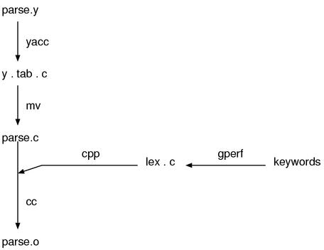
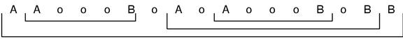
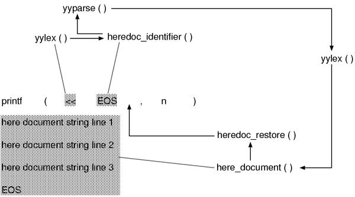

* * * * *

layout: default\
title: Parser\
—\
Translated by Robert GRAVINA & ocha-

Chapter 10: Parser
==================

Outline of this chapter
-----------------------

### Parser construction

The main source of the parser is \`parser.y\`.\
Because it is \`**.y\`, it is the input for \`yacc\`\
and \`parse.c\` is generated from it.
\
Although one would expect \`lex.c\` to contain the scanner, this is not
the case.\
This file is created by \`gperf\`, taking the file \`keywords\` as
input, and\
defines the reserved word hashtable. This tool-generated \`lex.c\` is
\`\#include\`d\
in \`parse.c\`. The details of this process is somewhat\
difficult to explain at this time, so we shall return to this later.
\
Figure 1 shows the parser construction process. For the benefit of those
readers\
using Windows who may not be aware, the \`mv\` command creates a new
copy\
of a file and removes the original. \`cc\` is, of course, the C compiler
and \`cpp\`\
the C pre-processor.
\

\
h3. Dissecting \`parse.y\`
\
Let’s now look at \`parse.y\` in a bit more detail. The following figure
presents\
a rough outline of the contents of \`parse.y\`.
\
▼ parse.y\
\<pre class=“longlist”\>\
{
header
}\
union ....
token ….\
type ....


rules


user code section
    parser interface
    scanner (character stream processing)
    syntax tree construction
    semantic analysis
    local variable management
    ID implementation
\</pre\>

As for the rules and definitions part, it is as previously described.
Since this part is indeed the heart of the parser,
I'll start to explain it ahead of the other parts in the next section.

There are a considerable number of support functions defined in the user code
section, but roughly speaking, they can be divided into the six parts
written above. The following table shows where each of parts are
explained in this book.

|\_. Part|\_. Chapter|\_. Section|
|Parser interface|This chapter|Section 3 "Scanning"|
|Scanner|This chapter|Section 3 "Scanning"|
|Syntax tree construction|Chapter 12 "Syntax tree construction"|Section 2 "Syntax tree construction"|
|Semantic analysis|Chapter 12 "Syntax tree construction"|Section 3 "Semantic analysis"|
|Local variable management|Chapter 12 "Syntax tree construction"|Section 4 "Local variables"|
|\`ID\` implementation|Chapter 3 "Names and name tables"|Section 2 "\`ID\` and symbols"|

h2. General remarks about grammar rules

h3. Coding rules

The grammar of \`ruby\` conforms to a coding standard and is thus easy to read
once you are familiar with it.

Firstly, regarding symbol names, all non-terminal symbols are written in lower
case characters. Terminal symbols are prefixed by some lower case character and
then followed by upper case. Reserved words (keywords) are prefixed with the
character \`k\`. Other terminal symbols are prefixed with the character \`t\`.

▼ Symbol name examples

|\_. Token|\_. Symbol name|
|(non-terminal symbol)|\`bodystmt\`|
|\`if\`|\`kIF\`|
|\`def\`|\`kDEF\`|
|\`rescue\`|\`kRESCUE\`|
|\`varname\`|\`tIDENTIFIER\`|
|\`ConstName\`|\`tCONST\`|
|1|\`tINTEGER\`|

The only exceptions to these rules are \`klBEGIN\` and \`klEND\`. These symbol names
refer to the reserved words for "BEGIN" and "END", respectively, and the \`l\`
here stands for \`large\`. Since the reserved words \`begin\` and \`end\` already
exist (naturally, with symbol names \`kBEGIN\` and \`kEND\`), these non-standard
symbol names were required.

h3. Important symbols

\`parse.y\` contains both grammar rules and actions, however, for now I would like
to concentrate on the grammar rules alone. The script sample/exyacc.rb can be
used to extract the grammar rules from this file.
Aside from this, running \`yacc -v\` will create a logfile \`y.output\`
which also contains the grammar rules,
however it is rather difficult to read. In this chapter I have used a slighty
modified version of \`exyacc.rb\`\\footnote{modified \`exyacc.rb\`:\`tools/exyacc2.rb\`
located on the attached CD-ROM} to extract the grammar rules.

▼ \`parse.y\`(rules)
\<pre class="longlist"\>
program         : compstmt

bodystmt        : compstmt
                  opt\_rescue
                  opt\_else
                  opt\_ensure

compstmt        : stmts opt\_terms
                       :
                       :
\</pre\>

The output is quite long - over 450 lines of grammar rules - and as such I have
only included the most important parts in this chapter.

Which symbols, then, are the most important? The names such as \`program\`, \`expr\`,
\`stmt\`,\`primary\`, \`arg\` etc. are always very important. It's because they
represent the general parts of the grammatical elements of a programming
language. The following table outlines the elements we should generally focus on
in the syntax of a program.


|\_. Syntax element|\_. Predicted symbol names|
|Program|\`program prog file input stmts whole\`|
|Sentence|\`statement stmt\`|
|Expression|\`expression expr exp\`|
|Smallest element|\`primary prim\`|
|Left hand side of an expression|\`lhs\`(left hand side)|
|Right hand side of an expression|\`rhs\`(right hand side)|
|Function call|\`funcall function\_call call function\`|
|Method call|\`method method\_call call\`|
|Argument|\`argument arg\`|
|Function definition|\`defun definition function fndef\`|
|Declarations|\`declaration decl\`|

In general, programming languages tend to have the following hierarchy structure.

|\_. Program element|\_. Properties|
|Program|Usually a list of statements|
|Statement|What can not be combined with the others. A syntax tree trunk.|
|Expression|What is a combination by itself and can also be a part of another
expression. A syntax tree internal node.|
|Primary|An element which can not be further decomposed. A syntax tree leaf node.|


The statements are things like function definitions in C or class definitions
in Java. An expression can be a procedure call, an arithmetic expression
etc., while a primary usually refers to a string literal or number. Some languages
do not contain all of these symbol types, however they generally contain some
kind of hierarchy of symbols such as \`program\`→\`stmt\`→\`expr\`→\`primary\`.

However, a structure at a low level can be contained by a superior structure.
For example, in C a function call is an expression but it can solely be put.
It means it is an expression but it can also be a statement.

Conversely, when surrounded in parentheses, expressions become primaries.
It is because the lower the level of a element the higher the precedence it has.

The range of statements differ considerably between programming languages.
Let's consider assignment as an example.
In C, because it is part of expressions, we can use the value of the whole
assignment expression. But in Pascal, assignment is a statement, we cannot do
such thing. Also,
function and class definitions are typically statements however in languages
such as Lisp and Scheme, since everything is an expression,
they do not have statements in the first place.
Ruby is close to Lisp's design in this regard.

h3. Program structure

Now let's turn our attention to the grammar rules of \`ruby\`. Firstly,
in \`yacc\`, the left hand side of the first rule represents the entire grammar.
Currently, it is \`program\`.
Following further and further from here,
as the same as the established tactic,
the four \`program stmt expr primary\` will be found.
With adding \`arg\` to them, let's look at their rules.


▼ \`ruby\` grammar (outline)
\<pre class="longlist"\>
program         : compstmt

compstmt        : stmts opt\_terms

stmts           : none
                | stmt
                | stmts terms stmt

stmt            : kALIAS fitem  fitem
                | kALIAS tGVAR tGVAR
                    :
                    :
                | expr

expr            : kRETURN call\_args
                | kBREAK call\_args
                    :
                    :
                | '!' command\_call
                | arg

arg             : lhs '=' arg
                | var\_lhs tOP\_ASGN arg
                | primary\_value '[' aref\_args ']' tOP\_ASGN arg
                    :
                    :
                | arg '?' arg ':' arg
                | primary

primary         : literal
                | strings
                    :
                    :
                | tLPAREN\_ARG expr  ')'
                | tLPAREN compstmt ')'
                    :
                    :
                | kREDO
                | kRETRY
\</pre\>

If we focus on the last rule of each element,
we can clearly make out a hierarchy of \`program\`→\`stmt\`→\`expr\`→\`arg\`→
\`primary\`.

Also, we'd like to focus on this rule of \`primary\`.

\<pre class="emlist"\>
primary         : literal
                    :
                    :
                | tLPAREN\_ARG expr  ')'      /\* here \*/
\</pre\>

The name \`tLPAREN\_ARG\` comes from \`t\` for terminal symbol, \`L\` for left and
\`PAREN\` for parentheses - it is the open parenthesis. Why this isn't \`'('\`
is covered in the next section "Context-dependent scanner". Anyway, the purpose
of this rule is demote an \`expr\` to a \`primary\`. This creates
a cycle which can the seen in Figure 2, and the arrow shows how this rule is
reduced during parsing.

!images/ch\_parser\_exprloop.jpg(Figure 2: \`expr\` demotion)!

The next rule is also particularly interesting.

\<pre class="emlist"\>
primary         : literal
                    :
                    :
                | tLPAREN compstmt ')'   /\* here \*/
\</pre\>

A \`compstmt\`, which equals to the entire program (\`program\`), can be demoted to
a \`primary\` with this rule. The next figure illustrates this rule in action.

!images/ch\_parser\_progloop.jpg(Figure 3: \`program\` demotion)!

This means that for any syntax element in Ruby, if we surround it with
parenthesis it will become a \`primary\` and can be passed as an argument to a
function, be used as the right hand side of an expression etc.
This is an incredible fact.
Let's actually confirm it.

\<pre class="emlist"\>
p((class C; end))
p((def a() end))
p((alias ali gets))
p((if true then nil else nil end))
p((1 + 1 \* 1 \*\* 1 - 1 / 1 \^ 1))
\</pre\>

If we invoke \`ruby\` with the \`-c\` option (syntax check), we get the following
output.

\<pre class="screen"\>
 ruby ~~c primprog.rb\
Syntax OK\
\</pre\>

\
Indeed, it’s hard to believe but, it could actually pass.\
Apparently, we did not get the wrong idea.
\
If we care about the details,\
since there are what rejected by the semantic analysis , it is not
perfectly possible.\
For example passing a \`return\` statement as an argument to a\
function will result in an error.\
But at least at the level of the outlooks, the “surrounding\
anything in parenthesis means it can be passed as an argument to a
function”\
rule does hold.
\
In the next section I will cover the contents of the important elements
one by\
one.
\
h3. \`program\`
\
▼ \`program\`\
\<pre class=“longlist”\>\
program : compstmt
\
compstmt : stmts opt\_terms
\
stmts : none\
 | stmt\
 | stmts terms stmt\
\</pre\>
\
As mentioned earlier,\
\`program\` represents the entire grammar that means the entire
program.\
That \`program\` equals to \`compstmts\`,\
and \`compstmts\` is almost equivalent to \`stmts\`.\
That \`stmts\` is a list of \`stmt\`s delimited by \`terms\`.\
Hence, the entire program is a list of \`stmt\`s delimited by \`terms\`.
\
\`terms\` is an abbreviation for “terminators”, the symbols that\
terminate the sentences, such as semicolons or newlines.\
\`opt\_terms\` means “OPTional terms”. The definitions are as follows:
\
▼ \`opt\_terms\`\
\<pre class=“longlist”\>\
opt\_terms :\
 | terms
\
terms : term\
 | terms ‘;’
\
term : ‘;’\
 | ‘\n’\
\</pre\>
\
The initial \`;\` or \`\\n\` of a \`terms\` can be followed by any
number of \`;\` only; based on that, you might start thinking that if
there are 2 or more consecutive newlines, it could cause a problem.
Let’s try and see what actually happens.
\
\<pre class=“emlist”\>\
1 + 1 \# first newline\
 \# second newline\
 \# third newline\
1 + 1\
\</pre\>
\
Run that with \`ruby~~c\`.
\
\<pre class=“screen”\>\
 ruby -c optterms.rb
Syntax OK
\</pre\>

Strange, it worked! What actually happens is this: consecutive newlines are simply discarded by the scanner, which returns only the first newline in a series.

By the way, although we said that \`program\` is the same as \`compstmt\`, if that was really true, you would question why \`compstmt\` exists at all. Actually, the distinction is there only for execution of semantic actions. \`program\` exists to execute any semantic actions which should be done once in the processing of an entire program. If it was only a question of parsing, \`program\` could be omitted with no problems at all.

To generalize this point, the grammar rules can be divided into 2 groups: those which are needed for parsing the program structure, and those which are needed for execution of semantic actions. The \`none\` rule which was mentioned earlier when talking about \`stmts\` is another one which exists for executing actions -- it's used to return a \`NULL\` pointer for an empty list of type \`NODE\*\`.

h3. \`stmt\`

Next is \`stmt\`. This one is rather involved, so we'll look into it a bit at a time.

▼ \`stmt\`(1)
\<pre class="longlist"\>
stmt            : kALIAS fitem  fitem
                | kALIAS tGVAR tGVAR
                | kALIAS tGVAR tBACK\_REF
                | kALIAS tGVAR tNTH\_REF
                | kUNDEF undef\_list
                | stmt kIF\_MOD expr\_value
                | stmt kUNLESS\_MOD expr\_value
                | stmt kWHILE\_MOD expr\_value
                | stmt kUNTIL\_MOD expr\_value
                | stmt kRESCUE\_MOD stmt
                | klBEGIN '{' compstmt '}'
                | klEND '{' compstmt '}'
\</pre\>

Looking at that, somehow things start to make sense. The first few have \`alias\`, then \`undef\`, then the next few are all something followed by \`\_MOD\` -- those should be statements with postposition modifiers, as you can imagine.

\`expr\_value\` and \`primary\_value\` are grammar rules which exist to execute semantic actions. For example, \`expr\_value\` represents an \`expr\` which has a value. Expressions which don't have values are \`return\` and \`break\`, or \`return\`/\`break\` followed by a postposition modifier, such as an \`if\` clause. For a detailed definition of what it means to "have a value", see chapter 12, "Syntax Tree Construction". In the same way, \`primary\_value\` is a \`primary\` which has a value.

As explained earlier, \`klBEGIN\` and \`klEND\` represent \`BEGIN\` and \`END\`.

▼ \`stmt\`(2)
\<pre class="longlist"\>
                | lhs '=' command\_call
                | mlhs '=' command\_call
                | var\_lhs tOP\_ASGN command\_call
                | primary\_value '[' aref\_args ']' tOP\_ASGN command\_call
                | primary\_value '.' tIDENTIFIER tOP\_ASGN command\_call
                | primary\_value '.' tCONSTANT tOP\_ASGN command\_call
                | primary\_value tCOLON2 tIDENTIFIER tOP\_ASGN command\_call
                | backref tOP\_ASGN command\_call
\</pre\>

Looking at these rules all at once is the right approach.
The common point is that they all have \`command\_call\` on the right-hand side. \`command\_call\` represents a method call with the parentheses omitted. The new symbols which are introduced here are explained in the following table. I hope you'll refer to the table as you check over each grammar rule.

|\`lhs\`| the left hand side of an assignment (Left Hand Side)|
|\`mlhs\`| the left hand side of a multiple assignment (Multiple Left Hand Side)|
|\`var\_lhs\`| the left hand side of an assignment to a kind of variable  (VARiable Left Hand Side) |
|\`tOP\_ASGN\`|compound assignment operator like \`+=\` or \`\*=\` (OPerator ASsiGN)|
|\`aref\_args\`|argument to a \`[]\` method call (Array REFerence)|
|\`tIDENTIFIER\`|identifier which can be used as a local variable|
|\`tCONSTANT\`|constant identifier (with leading uppercase letter)|
|\`tCOLON2\`|\`::\`|
|\`backref\`|\`\$1 \$2 \$3...\`|


\`aref\` is a \`Lisp\` jargon.
There's also \`aset\` as the other side of a pair,
which is an abbreviation of "array set".
This abbreviation is used at a lot of places in the source code of \`ruby\`.


\<p class="caption"\>▼ \`stmt\` (3)\</p\>
\<pre class="longlist"\>
                | lhs '=' mrhs\_basic
                | mlhs '=' mrhs
\</pre\>


These two are multiple assignments.
\`mrhs\` has the same structure as \`mlhs\` and it means multiple \`rhs\` (the right hand side).
We've come to recognize that knowing the meanings of names makes the comprehension much easier.


\<p class="caption"\>▼ \`stmt\` (4)\</p\>
\<pre class="longlist"\>
                | expr
\</pre\>


Lastly, it joins to \`expr\`.


h3. \`expr\`


\<p class="caption"\>▼ \`expr\` \</p\>
\<pre class="longlist"\>
expr            : kRETURN call\_args
                | kBREAK call\_args
                | kNEXT call\_args
                | command\_call
                | expr kAND expr
                | expr kOR expr
                | kNOT expr
                | '!' command\_call
                | arg
\</pre\>


Expression. The expression of \`ruby\` is very small in grammar.
That's because those ordinary contained in \`expr\` are mostly went into \`arg\`.
Conversely speaking, those who could not go to \`arg\` are left here.
And what are left are, again, method calls without parentheses.
\`call\_args\` is an bare argument list,
\`command\_call\` is, as previously mentioned, a method without parentheses.
If this kind of things was contained in the "small" unit,
it would cause conflicts tremendously.


However, these two below are of different kind.


\<pre class="emlist"\>
expr kAND expr
expr kOR expr
\</pre\>


\`kAND\` is "\`and\`", and \`kOR\` is "\`or\`".
Since these two have their roles as control structures,
they must be contained in the "big" syntax unit which is larger than \`command\_call\`.
And since \`command\_call\` is contained in \`expr\`,
at least they need to be \`expr\` to go well.
For example, the following usage is possible ...


\<pre class="emlist"\>
  valid\_items.include? arg  or raise ArgumentError, 'invalid arg'
\# valid\_items.include?(arg) or raise(ArgumentError, 'invalid arg')
\</pre\>


However, if the rule of \`kOR\` existed in \`arg\` instead of \`expr\`,
it would be joined as follows.


\<pre class="emlist"\>
valid\_items.include?((arg or raise)) ArgumentError, 'invalid arg'
\</pre\>


Obviously, this would end up a parse error.


h3. \`arg\`


\<p class="caption"\>▼ \`arg\` \</p\>
\<pre class="longlist"\>
arg             : lhs '=' arg
                | var\_lhs tOP\_ASGN arg
                | primary\_value '[' aref\_args ']' tOP\_ASGN arg
                | primary\_value '.' tIDENTIFIER tOP\_ASGN arg
                | primary\_value '.' tCONSTANT tOP\_ASGN arg
                | primary\_value tCOLON2 tIDENTIFIER tOP\_ASGN arg
                | backref tOP\_ASGN arg
                | arg tDOT2 arg
                | arg tDOT3 arg
                | arg '+' arg
                | arg '-' arg
                | arg '\*' arg
                | arg '/' arg
                | arg '‘arg\
 | arg tPOW arg\
 | tUPLUS arg\
 | tUMINUS arg\
 | arg’|‘arg\
 | arg’\^‘arg\
 | arg’&’ arg\
 | arg tCMP arg\
 | arg ‘\>’ arg\
 | arg tGEQ arg\
 | arg ‘\<’ arg\
 | arg tLEQ arg\
 | arg tEQ arg\
 | arg tEQQ arg\
 | arg tNEQ arg\
 | arg tMATCH arg\
 | arg tNMATCH arg\
 | ‘![](' arg
                | '~' arg
                | arg tLSHFT arg
                | arg tRSHFT arg
                | arg tANDOP arg
                | arg tOROP arg
                | kDEFINED opt_nl  arg
                | arg '?' arg ':' arg
                | primary
</pre>


Although there are many rules here, the complexity of the grammar is not
proportionate to the number of rules.
A grammar that merely has a lot of cases can be handled very easily by `yacc`,
rather, the depth or recursive of the rules has more influences the complexity.

Then, it makes us curious about the rules are defined recursively in the form
of `arg OP arg` at the place for operators,
but because for all of these operators their operator precedences are defined,
this is virtually only a mere enumeration.
Let's cut the "mere enumeration" out from the `arg` rule by merging.


<pre class="emlist">
arg: lhs '=' arg              /* 1 */
   | primary T_opeq arg       /* 2 */
   | arg T_infix arg          /* 3 */
   | T_pre arg                /* 4 */
   | arg '?' arg ':' arg      /* 5 */
   | primary                  /* 6 */
</pre>


There's no meaning to distinguish terminal symbols from lists of terminal symbols,
they are all expressed with symbols with `T_`.
`opeq` is `operator + equal`,
`T_pre` represents the prepositional operators such as `')’\` and
\`’\~‘\`,\
\`T\_infix\` represents the infix operators such as \`’**‘\` and \`’'\`.


To avoid conflicts in this structure,
things like written below become important
(but, these does not cover all).


\* \`T\_infix\` should not contain \`'='\`.

Since \`args\` partially overlaps \`lhs\`,
if \`'='\` is contained, the rule 1 and the rule 3 cannot be distinguished.


\* \`T\_opeq\` and \`T\_infix\` should not have any common rule.

Since \`args\` contains \`primary\`,
if they have any common rule, the rule 2 and the rule 3 cannot be distinguished.


\* \`T\_infix\` should not contain \`'?'\`.

If it contains, the rule 3 and 5 would produce a shift/reduce conflict.


\* \`T\_pre\` should not contain \`'?'\` or \`':'\`.

If it contains, the rule 4 and 5 would conflict in a very complicated way.


The conclusion is all requirements are met and this grammar does not conflict.
We could say it's a matter of course.


h3. \`primary\`

Because \`primary\` has a lot of grammar rules, we'll split them up and show them in parts.

\<p class="caption"\>▼ \`primary\` (1)\</p\>
\<pre class="longlist"\>
primary         : literal
                | strings
                | xstring
                | regexp
                | words
                | qwords
\</pre\>


Literals.
\`literal\` is for \`Symbol\` literals (\`:sym\`) and numbers.


\<p class="caption"\>▼ \`primary\` (2)\</p\>
\<pre class="longlist"\>
                | var\_ref
                | backref
                | tFID
\</pre\>


Variables.
\`var\_ref\` is for local variables and instance variables and etc.
\`backref\` is for \`\$1 \$2 \$3\` ...
\`tFID\` is for the identifiers with \`!\` or \`?\`, say, \`include? reject!\`.
There's no possibility of \`tFID\` being a local variable,
even if it appears solely, it becomes a method call at the parser level.


\<p class="caption"\>▼ \`primary\` (3)\</p\>
\<pre class="longlist"\>
                | kBEGIN
                  bodystmt
                  kEND
\</pre\>

\`bodystmt\` contains \`rescue\` and \`ensure\`.
It means this is the \`begin\` of the exception control.


\<p class="caption"\>▼ \`primary\` (4)\</p\>
\<pre class="longlist"\>
                | tLPAREN\_ARG expr  ')'
                | tLPAREN compstmt ')'
\</pre\>

This has already described. Syntax demoting.


\<p class="caption"\>▼ \`primary\` (5)\</p\>
\<pre class="longlist"\>
                | primary\_value tCOLON2 tCONSTANT
                | tCOLON3 cname
\</pre\>

Constant references. \`tCONSTANT\` is for constant names (capitalized identifiers).


Both \`tCOLON2\` and \`tCOLON3\` are \`::\`,
but \`tCOLON3\` represents only the \`::\` which means the top level.
In other words, it is the \`::\` of \`::Const\`.
The \`::\` of \`Net::SMTP\` is \`tCOLON2\`.


The reason why different symbols are used for the same token
is to deal with the methods without parentheses.
For example, it is to distinguish the next two from each other:


\<pre class="emlist"\>
p Net::HTTP    \# p(Net::HTTP)
p Net  ::HTTP  \# p(Net(::HTTP))
\</pre\>

If there's a space or a delimiter character such as an open parenthesis just before it,
it becomes \`tCOLON3\`. In the other cases, it becomes \`tCOLON2\`.


\<p class="caption"\>▼ \`primary\` (6)\</p\>
\<pre class="longlist"\>
                | primary\_value '[' aref\_args ']'
\</pre\>

Index-form calls, for instance, \`arr[i]\`.


\<p class="caption"\>▼ \`primary\` (7)\</p\>
\<pre class="longlist"\>
                | tLBRACK aref\_args ']'
                | tLBRACE assoc\_list '}'
\</pre\>

Array literals and Hash literals.
This \`tLBRACK\` represents also \`'['\`,
\`'['\` means a \`'['\` without a space in front of it.
The necessity of this differentiation is also a side effect of method calls
without parentheses.

The terminal symbols of this rule is very incomprehensible because they differs
in just a character.
The following table shows how to read each type of parentheses,
so I'd like you to make use of it when reading.


\<p class="caption"\>▼ English names for each parentheses \</p\>
| Symbol | English Name |
| () | parentheses |
| {} | braces |
| [] | brackets |


\<p class="caption"\>▼ \`primary\` (8)\</p\>
\<pre class="longlist"\>
                | kRETURN
                | kYIELD '(' call\_args ')'
                | kYIELD '(' ')'
                | kYIELD
                | kDEFINED opt\_nl '('  expr ')'
\</pre\>


Syntaxes whose forms are similar to method calls.
Respectively, \`return\`, \`yield\`, \`defined?\`.

There arguments for \`yield\`, but \`return\` does not have any arguments. Why?
The fundamental reason is that \`yield\` itself has its return value but
\`return\` does not.
However, even if there's not any arguments here,
it does not mean you cannot pass values, of course.
There was the following rule in \`expr\`.


\<pre class="emlist"\>
kRETURN call\_args
\</pre\>


\`call\_args\` is a bare argument list,
so it can deal with \`return 1\` or \`return nil\`.
Things like \`return(1)\` are handled as \`return (1)\`.
For this reason,
surrounding the multiple arguments of a \`return\` with parentheses
as in the following code should be impossible.


\<pre class="emlist"\>
return(1, 2, 3)   \# interpreted as return  (1,2,3) and results in parse error
\</pre\>


You could understand more about around here
if you will check this again after reading
the next chapter "Finite-State Scanner".


\<p class="caption"\>▼ \`primary\` (9)\</p\>
\<pre class="longlist"\>
                | operation brace\_block
                | method\_call
                | method\_call brace\_block
\</pre\>


Method calls. \`method\_call\` is with arguments (also with parentheses),
\`operation\` is without both arguments and parentheses,
\`brace\_block\` is either \`{\` \~ \`}\` or \`do\` \~ \`end\`
and if it is attached to a method, the method is an iterator.
For the question "Even though it is \`brace\`, why is \`do\` \~ \`end\` contained in
it?", there's a reason that is more abyssal than Marian Trench,
but again the only way to understand is reading
the next chapter "Finite-State Scanner".


\<p class="caption"\>▼ \`primary\` (10)\</p\>
\<pre class="longlist"\>
  | kIF expr\_value then compstmt if\_tail kEND         \# if
  | kUNLESS expr\_value then compstmt opt\_else kEND    \# unless
  | kWHILE expr\_value do compstmt kEND                \# while
  | kUNTIL expr\_value do compstmt kEND                \# until
  | kCASE expr\_value opt\_terms case\_body kEND         \# case
  | kCASE opt\_terms case\_body kEND                    \# case(Form2)
  | kFOR block\_var kIN expr\_value do compstmt kEND    \# for
\</pre\>


The basic control structures.
A little unexpectedly, things appear to be this big are put inside \`primary\`,
which is "small".
Because \`primary\` is also \`arg\`,
we can also do something like this.


\<pre class="emlist"\>
p(if true then 'ok' end)   \# shows "ok"
\</pre\>


I mentioned "almost all syntax elements are expressions"
was one of the traits of Ruby.
It is concretely expressed by the fact that \`if\` and \`while\` are in \`primary\`.

Why is there no problem if these "big" elements are contained in \`primary\`?
That's because the Ruby's syntax has a trait that "it begins with the terminal
symbol A and ends with the terminal symbol B".
In the next section, we'll think about this point again.


\<p class="caption"\>▼ \`primary\` (11)\</p\>
\<pre class="longlist"\>
  | kCLASS cname superclass bodystmt kEND        \# class definition
  | kCLASS tLSHFT expr term bodystmt kEND        \# singleton class definition
  | kMODULE cname bodystmt kEND                  \# module definition
  | kDEF fname f\_arglist bodystmt kEND           \# method definition
  | kDEF singleton dot\_or\_colon fname f\_arglist bodystmt kEND
                                                 \# singleton method definition
\</pre\>


Definition statements.
I've called them the class statements and the class statements,
but essentially I should have been called them the class primaries, probably.
These are all fit the pattern "beginning with the terminal symbol A and ending with B",
even if such rules are increased a lot more,
it would never be a problem.


\<p class="caption"\>▼ \`primary\` (12)\</p\>
\<pre class="longlist"\>
                | kBREAK
                | kNEXT
                | kREDO
                | kRETRY
\</pre\>


Various jumps.
These are, well, not important from the viewpoint of grammar.


h3. Conflicting Lists


In the previous section, the question "is it all right that \`if\` is in such
\`primary\`?" was suggested.
To proof precisely is not easy,
but explaining instinctively is relatively easy.
Here, let's simulate with a small rule defined as follows:


\<pre class="emlist"\>
token A B o\
\
element : A item\_list B

item\_list :\
 | item\_list item

item : element\
 | o\

</pre>
\`element\` is the element that we are going to examine.\
For example, if we think about \`if\`, it would be \`if\`.\
\`element\` is a list that starts with the terminal symbol \`A\` and
ends with \`B\`.\
As for \`if\`, it starts with \`if\` and ends with \`end\`.\
The \`o\` contents are methods or variable references or literals.\
For an element of the list, the \`o\` or \`element\` is nesting.

With the parser based on this grammar,\
let’s try to parse the following input.

<pre class="emlist">
A A o o o B o A o A o o o B o B B\

</pre>
They are nesting too many times for humans to comprehend\
without some helps such as indents.\
But it becomes relatively easy if you think in the next way.\
Because it’s certain that \`A\` and \`B\` which contain only several
\`o\` between\
them are going to appear, replace them to a single \`o\` when they
appear.\
All we have to do is repeating this procedure.\
Figure 4 shows the consequence.

<p class="image">
<br>\
Figure 4: parse a list which starts with A and ends with B\

</p>
However, if the ending \`B\` is missing, …

<pre class="emlist">
token A o

element   : A item\_list    /\* B is deleted for an experiment \*/

item\_list :
          | item\_list item

item      : element
          | o
\</pre\>


I processed this with \`yacc\` and got 2 shift/reduce conflicts.
It means this grammar is ambiguous.
If we simply take \`B\` out from the previous one,
The input would be as follows.


\<pre class="emlist"\>
A  A  o  o  o  o  A  o  A  o  o  o  o
\</pre\>


This is hard to interpret in any way. However, there was a rule that "choose
shift if it is a shift/reduce conflict",
let's follow it as an experiment and parse the input
with shift (meaning interior) which takes precedence. (Figure 5)


\<p class="image"\>
\\<br\>
Figure 5: parse a list of lists which start with A
\</p\>


It could be parsed. However, this is completely different from the intention of
the input, there becomes no way to split the list in the middle.


Actually, the methods without parentheses of Ruby is in the similar situation
to this. It's not so easy to understand but
a pair of a method name and its first argument is \`A\`.
This is because, since there's no comma only between the two,
it can be recognized as the start of a new list.


Also, the "practical" HTML contains this pattern.
It is, for instance, when \`\</p\>\` or \`\</i\>\` is omitted.
That's why \`yacc\` could not be used for ordinary HTML at all.


h2. Scanner


h3. Parser Outline


I'll explain about the outline of the parser before moving on to the scanner.
Take a look at Figure 6.


\<p class="image"\>
\\<br\>
Figure 6: Parser Interface (Call Graph)
\</p\>


There are three official interfaces of the parser: \`rb\_compile\_cstr()\`,
\`rb\_compile\_string()\`, \`rb\_compile\_file()\`.
They read a program from C string,
a Ruby string object and a Ruby \`IO\` object, respectively, and compile it.


These functions, directly or indirectly, call \`yycompile()\`,
and in the end, the control will be completely moved to \`yyparse()\`,
which is generated by \`yacc\`.
Since the heart of the parser is nothing but \`yyparse()\`,
it's nice to understand by placing \`yyparse()\` at the center.
In other words, functions before moving on to \`yyparse()\` are all preparations,
and functions after \`yyparse()\` are merely chore functions being pushed around
by \`yyparse()\`.


The rest functions in \`parse.y\` are auxiliary functions called by \`yylex()\`,
and these can also be clearly categorized.


First, the input buffer is at the lowest level of the scanner.
\`ruby\` is designed so that you can input source programs via both Ruby \`IO\`
objects and strings.
The input buffer hides that and makes it look like a single byte stream.


The next level is the token buffer.
It reads 1 byte at a time from the input buffer,
and keeps them until it will form a token.


Therefore, the whole structure of \`yylex\` can be depicted as Figure 7.


\<div class="image"\>
\\<br\>
Figure 7: The whole picture of the scanner
\* 入力バッファ input buffer
\* バイト列 byte sequence
\* トークンバッファ token buffer
\* 記号列 symbol sequence
\</div\>


h3. The input buffer


Let's start with the input buffer. Its interfaces are only the three: \`nextc()\`, \`pushback()\`, \`peek()\`.


Although this is sort of insistent,
I said the first thing is to investigate data structures.
The variables used by the input buffer are the followings:


\<p class="caption"\>▼ the input buffer\</p\>
\<pre class="longlist"\>
2279  static char \*lex\_pbeg;
2280  static char \*lex\_p;
2281  static char \*lex\_pend;

(parse.y)
\</pre\>


The beginning, the current position and the end of the buffer.
Apparently, this buffer seems a simple single-line string buffer (Figure 8).


!images/ch\_parser\_ibuffer.jpg(Figure 8: The input buffer)!


h4. \`nextc()\`


Then, let's look at the places using them.
First, I'll start with \`nextc()\` that seems the most orthodox.


\<p class="caption"\>▼ \`nextc()\` \</p\>
\<pre class="longlist"\>
2468  static inline int
2469  nextc()
2470  {
2471      int c;
2472
2473      if (lex\_p == lex\_pend) {
2474          if (lex\_input) {
2475              VALUE v = lex\_getline();
2476
2477              if (NIL\_P(v)) return -1;
2478              if (heredoc\_end \> 0) {
2479                  ruby\_sourceline = heredoc\_end;
2480                  heredoc\_end = 0;
2481              }
2482              ruby\_sourceline++;
2483              lex\_pbeg = lex\_p = RSTRING(v)-\>ptr;
2484              lex\_pend = lex\_p + RSTRING(v)-\>len;
2485              lex\_lastline = v;
2486          }
2487          else {
2488              lex\_lastline = 0;
2489              return -1;
2490          }
2491      }
2492      c = (unsigned char)\*lex\_p++;
2493      if (c == '\\r' && lex\_p \<= lex\_pend && \*lex\_p == '\\n') {
2494          lex\_p++;
2495          c = '\\n';
2496      }
2497
2498      return c;
2499  }

(parse.y)
\</pre\>


It seems that the first \`if\` is to test if it reaches the end of the input buffer.
And, the \`if\` inside of it seems, since the \`else\` returns \`-1\` (\`EOF\`),
to test the end of the whole input.
Conversely speaking, when the input ends, \`lex\_input\` becomes 0.
((errata: it does not. lex\_input will never become 0 during ordinary scan.))


From this, we can see that strings are coming bit by bit into the input buffer.
Since the name of the function which updates the buffer is \`lex\_getline\`,
it's definite that each line comes in at a time.


Here is the summary:


\<pre class="emlist"\>
if ( reached the end of the buffer )
    if (still there's more input)
        read the next line
    else
        return EOF
move the pointer forward
skip reading CR of CRLF
return c
\</pre\>


Let's also look at the function \`lex\_getline()\`, which provides lines.
The variables used by this function are shown together in the following.


\<p class="caption"\>▼ \`lex\_getline()\` \</p\>
\<pre class="longlist"\>
2276  static VALUE (\*lex\_gets)();     /\* gets function \*/
2277  static VALUE lex\_input;         /\* non-nil if File \*/

2420  static VALUE
2421  lex\_getline()
2422  {
2423      VALUE line = (\*lex\_gets)(lex\_input);
2424      if (ruby\_debug\_lines && !NIL\_P(line)) {
2425          rb\_ary\_push(ruby\_debug\_lines, line);
2426      }
2427      return line;
2428  }

(parse.y)
\</pre\>


Except for the first line, this is not important.
Apparently, \`lex\_gets\` should be the pointer to the function to read a line,
\`lex\_input\` should be the actual input.
I searched the place where setting \`lex\_gets\` and this is what I found:


\<p class="caption"\>▼ set \`lex\_gets\` \</p\>
\<pre class="longlist"\>
2430  NODE\*
2431  rb\_compile\_string(f, s, line)
2432      const char \*f;
2433      VALUE s;
2434      int line;
2435  {
2436      lex\_gets = lex\_get\_str;
2437      lex\_gets\_ptr = 0;
2438      lex\_input = s;

2454  NODE\*
2455  rb\_compile\_file(f, file, start)
2456      const char \*f;
2457      VALUE file;
2458      int start;
2459  {
2460      lex\_gets = rb\_io\_gets;
2461      lex\_input = file;

(parse.y)
\</pre\>


\`rb\_io\_gets()\` is not a exclusive function for the parser
but one of the general-purpose library of Ruby.
It is the function to read a line from an \`IO\` object.


On the other hand, \`lex\_get\_str()\` is defined as follows:


\<p class="caption"\>▼ \`lex\_get\_str()\` \</p\>
\<pre class="longlist"\>
2398  static int lex\_gets\_ptr;

2400  static VALUE
2401  lex\_get\_str(s)
2402      VALUE s;
2403  {
2404      char \*beg, \*end, \*pend;
2405
2406      beg = RSTRING(s)-\>ptr;
2407      if (lex\_gets\_ptr) {
2408          if (RSTRING(s)-\>len == lex\_gets\_ptr) return Qnil;
2409          beg += lex\_gets\_ptr;
2410      }
2411      pend = RSTRING(s)-\>ptr + RSTRING(s)-\>len;
2412      end = beg;
2413      while (end \< pend) {
2414          if (\*end++ == '\\n') break;
2415      }
2416      lex\_gets\_ptr = end - RSTRING(s)-\>ptr;
2417      return rb\_str\_new(beg, end - beg);
2418  }

(parse.y)
\</pre\>


\`lex\_gets\_ptr\` remembers the place it have already read.
This moves it to the next \`\\n\`,
and simultaneously cut out at the place and return it.


Here, let's go back to \`nextc\`.
As described, by preparing the two functions with the same interface,
it switch the function pointer when initializing the parser,
and the other part is used in common.
It can also be said that the difference of the code is converted to the data
and absorbed. There was also a similar method of \`st\_table\`.


h4. \`pushback()\`


With the knowledge of the physical structure of the buffer and \`nextc\`,
we can understand the rest easily.
\`pushback()\` writes back a character. If put it in C, it is \`ungetc()\`.

\<p class="caption"\>▼ \`pushback()\` \</p\>
\<pre class="longlist"\>
2501  static void
2502  pushback(c)
2503      int c;
2504  {
2505      if (c == -1) return;
2506      lex\_p--;
2507  }

(parse.y)
\</pre\>


h4. \`peek()\`

\`peek()\` checks the next character without moving the pointer forward.


\<p class="caption"\>▼ \`peek()\` \</p\>
\<pre class="longlist"\>
2509  \#define peek(c) (lex\_p != lex\_pend && (c) == \*lex\_p)

(parse.y)
\</pre\>


h3. The Token Buffer


The token buffer is the buffer of the next level.
It keeps the strings until a token will be able to cut out.
There are the five interfaces as follows:

| \`newtok\` | begin a new token |
| \`tokadd\` | add a character to the buffer |
| \`tokfix\` | fix a token |
| \`tok\` | the pointer to the beginning of the buffered string |
| \`toklen\` | the length of the buffered string |
| \`toklast\` | the last byte of the buffered string |


Now, we'll start with the data structures.

\<p class="caption"\>▼ The Token Buffer \</p\>
\<pre class="longlist"\>
2271  static char \*tokenbuf = NULL;
2272  static int   tokidx, toksiz = 0;

(parse.y)
\</pre\>


\`tokenbuf\` is the buffer, \`tokidx\` is the end of the token
(since it is of \`int\`, it seems an index),
and \`toksiz\` is probably the buffer length.
This is also simply structured. If depicting it,
it would look like Figure 9.


!images/ch\_parser\_tbuffer.jpg(Figure 9: The token buffer)!


Let's continuously go to the interface and
read \`newtok()\`, which starts a new token.


\<p class="caption"\>▼ \`newtok()\` \</p\>
\<pre class="longlist"\>
2516  static char\*
2517  newtok()
2518  {
2519      tokidx = 0;
2520      if (!tokenbuf) {
2521          toksiz = 60;
2522          tokenbuf = ALLOC\_N(char, 60);
2523      }
2524      if (toksiz \> 4096) {
2525          toksiz = 60;
2526          REALLOC\_N(tokenbuf, char, 60);
2527      }
2528      return tokenbuf;
2529  }

(parse.y)
\</pre\>


The initializing interface of the whole buffer does not exist,
it's possible that the buffer is not initialized.
Therefore, the first \`if\` checks it and initializes it.
\`ALLOC\_N()\` is the macro \`ruby\` defines and is almost the same as  \`calloc\`.


The initial value of the allocating length is 60,
and if it becomes too big (\`\> 4096\`),
it would be returned back to small.
Since a token becoming this long is unlikely,
this size is realistic.


Next, let's look at the \`tokadd()\` to add a character to token buffer.


\<p class="caption"\>▼ \`tokadd()\` \</p\>
\<pre class="longlist"\>
2531  static void
2532  tokadd(c)
2533      char c;
2534  {
2535      tokenbuf[tokidx++] = c;
2536      if (tokidx \>= toksiz) {
2537          toksiz \*= 2;
2538          REALLOC\_N(tokenbuf, char, toksiz);
2539      }
2540  }

(parse.y)
\</pre\>


At the first line, a character is added.
Then, it checks the token length and if it seems about to exceed the buffer end,
it performs \`REALLOC\_N()\`.
\`REALLOC\_N()\` is a \`realloc()\` which has the same way of specifying arguments
as \`calloc()\`.


The rest interfaces are summarized below.

\<p class="caption"\>▼ \`tokfix() tok() toklen() toklast()\` \</p\>
\<pre class="longlist"\>
2511  \#define tokfix() (tokenbuf[tokidx]='\\0')
2512  \#define tok() tokenbuf
2513  \#define toklen() tokidx
2514  \#define toklast() (tokidx\>0?tokenbuf[tokidx-1]:0)

(parse.y)
\</pre\>


There's probably no question.


h3. \`yylex()\`


\`yylex()\` is very long. Currently, there are more than 1000 lines.
The most of them is occupied by a huge \`switch\` statement,
it branches based on each character.
First, I'll show the whole structure that some parts of it are left out.


\<p class="caption"\>▼ \`yylex\` outline \</p\>
\<pre class="longlist"\>
3106  static int
3107  yylex()
3108  {
3109      static ID last\_id = 0;
3110      register int c;
3111      int space\_seen = 0;
3112      int cmd\_state;
3113
3114      if (lex\_strterm) {
              /\* ... string scan ... \*/
3131          return token;
3132      }
3133      cmd\_state = command\_start;
3134      command\_start = Qfalse;
3135    retry:
3136      switch (c = nextc()) {
3137        case '\\0':                /\* NUL \*/
3138        case '\\004':              /\* \^D \*/
3139        case '\\032':              /\* \^Z \*/
3140        case -1:                  /\* end of script. \*/
3141          return 0;
3142
3143          /\* white spaces \*/
3144        case ' ': case '\\t': case '\\f': case '\\r':
3145        case '\\13': /\* '\\v' \*/
3146          space\_seen++;
3147          goto retry;
3148
3149        case '\#':         /\* it's a comment \*/
3150          while ((c = nextc()) != '\\n') {
3151              if (c == -1)
3152                  return 0;
3153          }
3154          /\* fall through \*/
3155        case '\\n':
              /\* ... omission ... \*/

            case xxxx:
                ：
              break;
                ：
            /\* branches a lot for each character \*/
                ：
                ：
4103        default:
4104          if (!is\_identchar(c) || ISDIGIT(c)) {
4105              rb\_compile\_error("Invalid char \`\\\\03o’ in
expression“, c);\
4106 goto retry;\
4107 }\
4108\
4109 newtok();\
4110 break;\
4111 }
\
 /\* … deal with ordinary identifiers … \*/\
 }
\
(parse.y)\
\</pre\>

\
As for the return value of \`yylex()\`,\
zero means that the input has finished,\
non-zero means a symbol.

\
Be careful that a extremely concise variable named”\`c\`" is used all
over this function.\
\`space\_seen++\` when reading a space will become helpful later.

All it has to do as the rest is to keep branching for each character and
processing it,\
but since continuous monotonic procedure is lasting, it is boring for
readers.\
Therefore, we’ll narrow them down to a few points.\
In this book not all characters will be explained,\
but it is easy if you will amplify the same pattern.

#### \`’‘\` \</p\>\
\<pre class=“longlist”\>\
3205 case’!‘:\
3206 lex\_state = EXPR\_BEG;\
3207 if ((c = nextc())  '=') {
3208              return tNEQ;
3209          }
3210          if (c ’~‘)\\ {\
3211\\ return\\ tNMATCH;\
3212\\ }\
3213\\ pushback©;\
3214\\ return’!‘;
\
(parse.y)\
\</pre\>

\
I\\ wroute\\ out\\ the\\ meaning\\ of\\ the\\ code,\
so\\ I’d\\ like\\ you\\ to\\ read\\ them\\ by\\ comparing\\ each\\ other.

\
\<pre\\ class=“emlist”\>\
case’!‘:\
\\ move\\ to\\ EXPR\_BEG\
\\ if\\ (the\\ next\\ character\\ is’=‘then)\\ {\
\\ token\\ is\\ 「!=(tNEQ)」\
\\ }\
\\ if\\ (the\\ next\\ character\\ is’~‘then) {\
 token is 「!~」\
\\ }\
\\ if\\ it\\ is\\ neither,\\ push\\ the\\ read\\ character\\ back\
\\ token\\ is\\ ’=“\`\\ can\\ be\\ interpreted\\ in\\ two\\ ways:”\`=\`“,\
but\\ in\\ this\\ case\\ \`”\`\\ of\\ \`not\`\\ or\\ it\\ is\\ \`~\`,\
its next symbol is the beginning of an expression.


\
h4. \`’\<‘\`

\
Next, we’ll try to look at \`’\<‘\` as an example of using \`yylval\` (the value of a symbol).

\
\<p class=“caption”\>▼ \`yylex\`−\`’&gt;‘\`\</p\>\
\<pre class=“longlist”\>\
3296 case’\>‘:\
3297 switch (lex\_state) {\
3298 case EXPR\_FNAME: case EXPR\_DOT:\
3299 lex\_state = EXPR\_ARG; break;\
3300 default:\
3301 lex\_state = EXPR\_BEG; break;\
3302 }\
3303 if ((c = nextc())  '=') {
3304              return tGEQ;
3305          }
3306          if (c ’\>‘) {\
3307 if ((c = nextc())  '=') {
3308                  yylval.id = tRSHFT;
3309                  lex\_state = EXPR\_BEG;
3310                  return tOP\_ASGN;
3311              }
3312              pushback(c);
3313              return tRSHFT;
3314          }
3315          pushback(c);
3316          return '\>';

(parse.y)
\</pre\>


The places except for \`yylval\` can be ignored.
Concentrating only one point when reading a program is essential.


At this point, for the symbol \`tOP\_ASGN\` of \`\>\>=\`, it set its value \`tRSHIFT\`.
Since the used union member is \`id\`, its type is \`ID\`.
\`tOP\_ASGN\` is the symbol of self assignment,
it represents all of the things like \`+=\` and \`-=\` and \`\*=\`.
In order to distinguish them later,
it passes the type of the self assignment as a value.


The reason why the self assignments are bundled is,
it makes the rule shorter.
Bundling things that can be bundled at the scanner as much as possible
makes the rule more concise.
Then, why are the binary arithmetic operators not bundled?
It is because they differs in their precedences.


h4. \`':'\`


If scanning is completely independent from parsing, this talk would be simple.
But in reality, it is not that simple.
The Ruby grammar is particularly complex,
it has a somewhat different meaning when there's a space in front of it,
the way to split tokens is changed depending on the situation around.
The code of \`':'\` shown below is an example that a space changes the behavior.


\<p class="caption"\>▼ \`yylex\`−\`':'\`\</p\>
\<pre class="longlist"\>
3761        case ':':
3762          c = nextc();
3763          if (c ’:‘) {\
3764 if (lex\_state  EXPR\_BEG ||  lex\_state  EXPR\_MID ||\
3765 (IS\_ARG() && space\_seen)) {\
3766 lex\_state = EXPR\_BEG;\
3767 return tCOLON3;\
3768 }\
3769 lex\_state = EXPR\_DOT;\
3770 return tCOLON2;\
3771 }\
3772 pushback©;\
3773 if (lex\_state  EXPR\_END ||
                  lex\_state  EXPR\_ENDARG ||\
 ISSPACE (c)) {\
3774 lex\_state = EXPR\_BEG;\
3775 return’:‘;\
3776 }\
3777 lex\_state = EXPR\_FNAME;\
3778 return tSYMBEG;
\
(parse.y)\
\</pre\>

\
Again, ignoring things relating to \`lex\_state\`,\
I’d like you focus on around \`space\_seen\`.
\
\`space\_seen\` is the variable that becomes true when there’s a space before a token.\
If it is met, meaning there’s a space in front of \`’::‘\`, it becomes \`tCOLON3\`,\
if there’s not, it seems to become \`tCOLON2\`.\
This is as I explained at \`primary\` in the previous section.


\
h4. Identifier

\
Until now, since there were only symbols,\
it was just a character or 2 characters.\
This time, we’ll look at a little long things.\
It is the scanning pattern of identifiers.

\
First, the outline of \`yylex\` was as follows:
\
\<pre class=“emlist”\>\
yylex(…)\
{\
 switch (c = nextc()) {\
 case xxxx:\
 ….\
 case xxxx:\
 ….\
 default:\
 }
\
 the scanning code of identifiers\
}\
\</pre\>

\
The next code is an extract from the end of the huge \`switch\`.\
This is relatively long, so I’ll show it with comments.

\
\<p class=“caption”\>▼ \`yylex\` — identifiers \</p\>\
\<pre class=“longlist”\>\
4081 case’`':                 /* an instance variable or a class variable */
4082          c = nextc();
4083          newtok();
4084          tokadd('`’);\
4085 if (c  '@') {         /\* @@, meaning a class variable \*/
4086              tokadd('@');
4087              c = nextc();
4088          }
4089          if (ISDIGIT(c)) {       /\* @1 and such  \*/
4090              if (tokidx  1) {\
4091 rb\_compile\_error(“\``` %c' is not a valid instance variable name", c);
4092              }
4093              else {
4094    rb_compile_error("` ```%c' is not a valid class variable name", c);
4095              }
4096          }
4097          if (!is_identchar(c)) { /* a strange character appears next to ` **/\
4098 pushback;\
4099 return ‘@’;\
4100 }\
4101 break;\
4102\
4103 default:\
4104 if || ISDIGIT (c)) {\
4105 rb\_compile\_error;\
4106 goto retry;\
4107 }\
4108\
4109 newtok;\
4110 break;\
4111 }\
4112\
4113 while ) { /** between characters that can be used as identifieres **/\
4114 tokadd;\
4115 if ) { /** if it is the head byte of a multi-byte character \*/\
4116 int i, len = mbclen©~~1;\
4117\
4118 for {\
4119 c = nextc;\
4120 tokadd;\
4121 }\
4122 }\
4123 c = nextc;\
4124 }\
4125 if &&\
 is\_identchar) &&\
 !peek) { /\* the end character of name! or name? **/\
4126 tokadd;\
4127 }\
4128 else {\
4129 pushback;\
4130 }\
4131 tokfix;
\
\
\</pre\>

\
Finally, I’d like you focus on the condition\
at the place where adding \`!\` or \`?\`.\
This part is to interpret in the next way.

\
\<pre class="emlist"\>\
obj.m=1 \# obj.m = 1 \
obj.m= 1 \
\</pre\>\
)

\
This is "not" longest-match.\
The "longest-match" is a principle but not a constraint.\
Sometimes, you can refuse it.


\
h4. The reserved words

\
After scanning the identifiers, there are about 100 lines of the code further\
to determine the actual symbols.\
In the previous code, instance variables, class variables and local variables,\
they are scanned all at once,\
but they are categorized here.

\
This is OK but, inside it there’s a little strange part.\
It is the part to filter the reserved words.\
Since the reserved words are not different from local variables in its\
character type, scanning in a bundle and categorizing later is more efficient.

\
Then, assume there’s \`str\` that is a \`char\*\` string,\
how can we determine whether it is a reserved word?\
First, of course, there’s a way of comparing a lot by \`if\` statements and \`strcmp\`.\
However, this is completely not smart. It is not flexible.\
Its speed will also linearly increase.\
Usually, only the data would be separated to a list or a hash\
in order to keep the code short.

\
\<pre class="emlist"\>\
/** convert the code to data **/\
struct entry ;\
struct entry**table; enum lex\_state state;};
\
\
\</pre\>

\
\`name\` is the name of the reserved word, \`id[0]\` is its symbol,\
\`id[1]\` is its symbol as a modification .\
\`lex\_state\` is "the \`lex\_state\` should be moved to after reading this reserved word".\
\`lex\_state\` will be explained in the next chapter.

\
This is the place where actually looking up.

\
\<p class="caption"\>▼ \`yylex\` — identifier — call \`rb\_reserved\_word\` \</p\>\
\<pre class="longlist"\>\
4173 struct kwtable **kw;\
4174\
4175 /** See if it is a reserved word. **/\
4176 kw = rb\_reserved\_word, toklen);\
4177 if {
\
\
\</pre\>


\
h3. Strings

\
The double quote part of \`yylex\` is this.

\
\<p class="caption"\>▼ \`yylex\` − \`’"‘\` \</p\>\
\<pre class=“longlist”\>\
3318 case’"‘:\
3319 lex\_strterm = NEW\_STRTERM(str\_dquote,’"‘, 0);\
3320 return tSTRING\_BEG;
\
(parse.y)\
\</pre\>

\
Surprisingly it finishes after scanning only the first character.\
Then, this time, when taking a look at the rule,\
\`tSTRING\_BEG\` is found in the following part:

\
\<p class=“caption”\>▼ rules for strings \</p\>\
\<pre class=“longlist”\>\
string1 : tSTRING\_BEG string\_contents tSTRING\_END
\
string\_contents :\
 | string\_contents string\_content
\
string\_content : tSTRING\_CONTENT\
 | tSTRING\_DVAR string\_dvar\
 | tSTRING\_DBEG term\_push compstmt’}’
\
string\_dvar : tGVAR\
 | tIVAR\
 | tCVAR\
 | backref
\
term\_push :\
\</pre\>

\
These rules are the part introduced to deal with embedded expressions inside of strings.\
\`tSTRING\_CONTENT\` is literal part,\
\`tSTRING\_DBEG\` is \`"\#\` can be left out.\
But this is often not recommended.\
\`D\` of \`DVAR\`, \`DBEG\` seems the abbreviation of \`dynamic\`.

\
And, \`backref\` represents the special variables relating to regular expressions,\
such as \`\$1 \$2\` or \`\$& \$’\`.

\
\`term\_push\` is "a rule defined for its action".

\
Now, we’ll go back to \`yylex\` here.\
If it simply returns the parser,\
since its context is the "interior" of a string,\
it would be a problem if a variable and \`if\` and others are suddenly scanned in\
the next \`yylex\`.\
What plays an important role there is …

\
\<pre class="emlist"\>\
 case ‘“‘:\
 lex\_strterm = NEW\_STRTERM(str\_dquote,’”’, 0);\
 return tSTRING\_BEG;\
\</pre\>

\
… \`lex\_strterm\`. Let’s go back to the beginning of \`yylex\`.

\
\<p class="caption"\>▼ the beginning of \`yylex\` \</p\>\
\<pre class="longlist"\>\
3106 static int\
3107 yylex\
3108 {\
3109 static ID last\_id = 0;\
3110 register int c;\
3111 int space\_seen = 0;\
3112 int cmd\_state;\
3113\
3114 if {\
 /** scanning string **/\
3131 return token;\
3132 }\
3133 cmd\_state = command\_start;\
3134 command\_start = Qfalse;\
3135 retry:\
3136 switch ) {
\
\
\</pre\>

\
If \`lex\_strterm\` exists, it enters the string mode without asking.\
It means, conversely speaking, if there’s \`lex\_strterm\`,\
it is while scanning string,\
and when parsing the embedded expressions inside strings,\
you have to set \`lex\_strterm\` to 0.\
And, when the embedded expression ends, you have to set it back.\
This is done in the following part:

\
\<p class="caption"\>▼ \`string\_content\` \</p\>\
\<pre class="longlist"\>\
1916 string\_content : ….\
1917 | tSTRING\_DBEG term\_push\
1918 {\
1919 \$<num>1 = lex\_strnest;\
1920 \$<node>\$ = lex\_strterm;\
1921 lex\_strterm = 0;\
1922 lex\_state = EXPR\_BEG;\
1923 }\
1924 compstmt ‘}’\
1925 {\
1926 lex\_strnest = \$<num>1;\
1927 quoted\_term = \$2;\
1928 lex\_strterm = \$<node>3;\
1929 if && nd\_type  NODE\_NEWLINE) {
1930                              \$\$ = \$\$-\>nd\_next;
1931                              rb\_gc\_force\_recycle((VALUE)\$4);
1932                          }
1933                          \$\$ = NEW\_EVSTR(\$\$);
1934                      }

(parse.y)
\</pre\>


In the embedded action, \`lex\_stream\` is saved as the value of \`tSTRING\_DBEG\`
(virtually, this is a stack push),
it recovers in the ordinary action (pop).
This is a fairly smart way.


But why is it doing this tedious thing?
Can't it be done by, after scanning normally,
calling \`yyparse()\` recursively at the point when it finds \`\#{\` ?
There's actually a problem.
\`yyparse()\` can't be called recursively.
This is the well known limit of \`yacc\`.
Since the \`yyval\` that is used to receive or pass a value is a global variable,
careless recursive calls can destroy the value.
With \`bison\` (\`yacc\` of GNU),
recursive calls are possible by using \`%pure\_parser\` directive,
but the current ruby decided not to assume \`bison\`.
In reality, \`byacc\` (Berkely yacc) is often used in BSD-derived OS and Windows and such,
if \`bison\` is assumed, it causes a little cumbersome.


h4. \`lex\_strterm\`


As we've seen, when you consider \`lex\_stream\` as a boolean value,
it represents whether or not the scanner is in the string mode.
But its contents also has a meaning.
First, let's look at its type.


\<p class="caption"\>▼ \`lex\_strterm\`\</p\>
\<pre class="longlist"\>
  72  static NODE \*lex\_strterm;

(parse.y)
\</pre\>


This definition shows its type is \`NODE\*\`.
This is the type used for syntax tree and will be discussed in detail
in Chapter 12: Syntax tree construction.
For the time being, it is a structure which has three elements,
since it is \`VALUE\` you don't have to \`free()\` it,
you should remember only these two points.


\<p class="caption"\>▼ \`NEW\_STRTERM()\`\</p\>
\<pre class="longlist"\>
2865  \#define NEW\_STRTERM(func, term, paren) \\
2866          rb\_node\_newnode(NODE\_STRTERM, (func), (term), (paren))

(parse.y)
\</pre\>


This is a macro to create a node to be stored in \`lex\_stream\`.
First, \`term\` is the terminal character of the string.
For example, if it is a \`"\` string, it is \`"\`,
and if it is a \`'\` string, it is \`'\`.


\`paren\` is used to store the corresponding parenthesis when it is a \`%\` string.
For example,

\<pre class="emlist"\>
%Q(..........)
\</pre\>


in this case, \`paren\` stores \`'('\`. And, \`term\` stores the closing parenthesis \`')'\`.
If it is not a \`%\` string, \`paren\` is 0.


At last, \`func\`, this indicates the type of a string.
The available types are decided as follows:


\<p class="caption"\>▼ \`func\`\</p\>
\<pre class="longlist"\>
2775  \#define STR\_FUNC\_ESCAPE 0x01  /\* backslash notations such as \\n are in effect  \*/
2776  \#define STR\_FUNC\_EXPAND 0x02  /\* embedded expressions are in effect \*/
2777  \#define STR\_FUNC\_REGEXP 0x04  /\* it is a regular expression \*/
2778  \#define STR\_FUNC\_QWORDS 0x08  /\* %w(....) or %W(....) \*/
2779  \#define STR\_FUNC\_INDENT 0x20  /\* \<\<-EOS(the finishing symbol can be indented) \*/
2780
2781  enum string\_type {
2782      str\_squote = (0),
2783      str\_dquote = (STR\_FUNC\_EXPAND),
2784      str\_xquote = (STR\_FUNC\_ESCAPE|STR\_FUNC\_EXPAND),
2785      str\_regexp = (STR\_FUNC\_REGEXP|STR\_FUNC\_ESCAPE|STR\_FUNC\_EXPAND),
2786      str\_sword  = (STR\_FUNC\_QWORDS),
2787      str\_dword  = (STR\_FUNC\_QWORDS|STR\_FUNC\_EXPAND),
2788  };

(parse.y)
\</pre\>


Each meaning of \`enum string\_type\` is as follows:


| \`str\_squote\` | \`'\` string / \`%q\` |
| \`str\_dquote\` | \`"\` string / \`%Q\` |
| \`str\_xquote\` | command string (not be explained in this book) |
| \`str\_regexp\` | regular expression |
| \`str\_sword\`  | \`%w\` |
| \`str\_dword\`  | \`%W\` |


h4. String scan function


The rest is reading \`yylex()\` in the string mode,
in other words, the \`if\` at the beginning.

\<p class="caption"\>▼ \`yylex\`− string\</p\>
\<pre class="longlist"\>
3114      if (lex\_strterm) {
3115          int token;
3116          if (nd\_type(lex\_strterm)  NODE\_HEREDOC) {\
3117 token = here\_document;\
3118 if {\
3119 lex\_strterm = 0;\
3120 lex\_state = EXPR\_END;\
3121 }\
3122 }\
3123 else {\
3124 token = parse\_string;\
3125 if {\
3126 rb\_gc\_force\_recyclelex\_strterm);\
3127 lex\_strterm = 0;\
3128 lex\_state = EXPR\_END;\
3129 }\
3130 }\
3131 return token;\
3132 }
\
\
\</pre\>

\
It is divided into the two major groups: here document and others.\
But this time, we won’t read \`parse\_string\`.\
As I previously described, there are a lot of conditions,\
it is tremendously being a spaghetti code.\
If I tried to explain it,\
odds are high that readers would complain that "it is as the code is written!".\
Furthermore, although it requires a lot of efforts, it is not interesting.

\
But, not explaining at all is also not a good thing to do,\
The modified version that functions are separately defined for each target to be scanned\
is contained in the attached CD-ROM .\
I’d like readers who are interested in to try to look over it.


\
h4. Here Document

\
In comparison to the ordinary strings, here documents are fairly interesting.\
That may be because, unlike the other elements, it deal with a line at a time.\
Moreover, it is terrific that the starting symbol can exist in the middle of a program.\
First, I’ll show the code of \`yylex\` to scan the starting symbol of a here document.

\
\<p class="caption"\>▼ \`yylex\`−\`’&lt;‘\`\</p\>\
\<pre class=“longlist”\>\
3260 case’\<‘:\
3261 c = nextc();\
3262 if (c  '\<' &&
3263              lex\_state != EXPR\_END &&
3264              lex\_state != EXPR\_DOT &&
3265              lex\_state != EXPR\_ENDARG &&
3266              lex\_state != EXPR\_CLASS &&
3267              (!IS\_ARG() || space\_seen)) {
3268              int token = heredoc\_identifier();
3269              if (token) return token;

(parse.y)
\</pre\>


As usual, we'll ignore the herd of \`lex\_state\`.
Then, we can see that it reads only "\`\<\<\`" here
and the rest is scanned at \`heredoc\_identifier()\`.\<br\>
Therefore, here is \`heredoc\_identifier()\`.


\<p class="caption"\>▼ \`heredoc\_identifier()\`\</p\>
\<pre class="longlist"\>
2926  static int
2927  heredoc\_identifier()
2928  {
          /\* ... omission ... reading the starting symbol \*/
2979      tokfix();
2980      len = lex\_p - lex\_pbeg;   /\*(A)\*/
2981      lex\_p = lex\_pend;         /\*(B)\*/
2982      lex\_strterm = rb\_node\_newnode(NODE\_HEREDOC,
2983                          rb\_str\_new(tok(), toklen()),  /\* nd\_lit \*/
2984                          len,                          /\* nd\_nth \*/
2985          /\*©\*/       lex\_lastline);                /\* nd\_orig \*/
2986
2987      return term ’\`’ ? tXSTRING\_BEG : tSTRING\_BEG;\
2988 }
\
\
\</pre\>

\
The part which reads the starting symbol is not important, so it is totally left out.\
Until now, the input buffer probably has become as depicted as Figure 10.\
Let’s recall that the input buffer reads a line at a time.
\
!images/ch\_parser\_lexparams.jpg"\`)!

\
What \`heredoc\_identifier\` is doing is as follows:<br>\
 \`len\` is the number of read bytes in the current line.<br>\
 and, suddenly move \`lex\_p\` to the end of the line.<br>\
It means that in the read line, the part after the starting symbol is read but\
not parsed. When is that rest part parsed?\
For this mystery, a hint is that at (C) the \`lex\_lastline\` and \`len\` are saved.

\
Then, the dynamic call graph before and after \`heredoc\_identifier\` is simply\
shown below:
\
\<pre class="emlist"\>\
yyparse\
 yylex\
 heredoc\_identifier\
 yylex\
 here\_document\
\</pre\>

\
And, this \`here\_document\` is doing the scan of the body of the here document.\
Omitting invalid cases and adding some comments,\
\`heredoc\_identifier\` is shown below.\
Notice that \`lex\_strterm\` remains unchanged after it was set at \`heredoc\_identifier\`.

\
\<p class="caption"\>▼ \`here\_document\`\</p\>\
\<pre class="longlist"\>\
here\_document\
{\
 VALUE line; /** the line currently being scanned **/\
 VALUE str = rb\_str\_new; /** a string to store the results **/
\
 /** … handling invalid conditions, omitted … **/
\
 if {\
 do {\
 line = lex\_lastline; /****/\
 rb\_str\_cat~~\>ptr, RSTRING (line)~~\>len);\
 lex\_p = lex\_pend; /****/\
 if  -1) {     /\*\*/
                goto error;
            }
        } while (the currently read line is not equal to the finishing symbol);
    }
    else {
        /\* the embeded expressions are available ... omitted \*/
    }
    heredoc\_restore(lex\_strterm);
    lex\_strterm = NEW\_STRTERM(-1, 0, 0);
    yylval.node = NEW\_STR(str);
    return tSTRING\_CONTENT;
}
\</pre\>

\`rb\_str\_cat()\` is the function to connect a \`char\*\` at the end of a Ruby string.
It means that the currently being read line \`lex\_lastline\` is connected to
\`str\` at (A). After it is connected, there's no use of the current line.
At (B), suddenly moving \`lex\_p\` to the end of line.
And  is a problem, in this place, it looks like doing the check whether
it is finished, but actually the next "line" is read.
I'd like you to recall that \`nextc()\` automatically reads the next line when
the current line has finished to be read.
So, since the current line is forcibly finished at (B),
\`lex\_p\` moves to the next line at ==.

\
And finally, leaving the \`do\` \~ \`while\` loop, it is \`heredoc\_restore\`.

\
\<p class="caption"\>▼ \`heredoc\_restore\` \</p\>\
\<pre class="longlist"\>\
2990 static void\
2991 heredoc\_restore\
2992 NODE**here;\
2993 {\
2994 VALUE line = here~~\>nd\_orig;\
2995 lex\_lastline = line;\
2996 lex\_pbeg = RSTRING (line)~~\>ptr;\
2997 lex\_pend = lex\_pbeg + RSTRING (line)~~\>len;\
2998 lex\_p = lex\_pbeg + here~~\>nd\_nth;\
2999 heredoc\_end = ruby\_sourceline;\
3000 ruby\_sourceline = nd\_line;\
3001 rb\_gc\_force\_recycle;\
3002 rb\_gc\_force\_recyclehere);\
3003 }
\
\
\</pre\>

\
\`here~~\>nd\_orig\` holds the line which contains the starting symbol.<br>\
\`here-\>nd\_nth\` holds the length already read in the line contains the starting\
symbol.<br>\
It means it can continue to scan from the just after the starting symbol\
as if there was nothing happened. (Figure 11)

\
\<p class=”image"\>\
<br>\
Figure 11: The picture of assignation of scanning Here Document\

</p>

